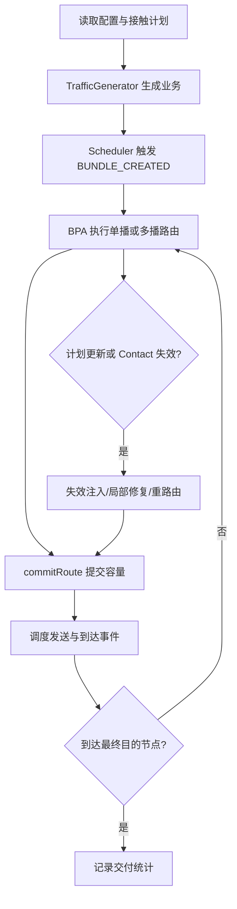

# 空间 DTN 网络 CGR/SABR 仿真系统项目论文

## 摘要

SABR 项目是一个面向空间延迟容忍网络的 C++17 离散事件仿真系统。系统以 CCSDS 734.3-B-1 Schedule-Aware Bundle Routing 标准为理论主线，以接触计划驱动的 Contact Graph 路由为核心，在此基础上扩展了多播传播计划、局部修复、受控冗余、副本去重、批量实验编排、结果导出和可视化能力。项目不仅实现了标准单播 SABR 的三阶段流程，还通过 plan_version 绑定、Phase 1/2/3 无副作用规划与显式提交分离、局部传播计划编码、多播共享前缀容量控制等机制，把理论算法落成了可复现、可测试、可批量评估的工程系统。本文系统介绍该项目的研究背景、理论基础、模块设计、运行流程、工程功能和六类实验结果。实验结果表明：系统在单播正确性、规模敏感性、多播传播计划效率、多播局部修复、单播冗余收益以及增强机制消融等方面均形成了清晰、可解释的结论；同时，Stage 9 交付链路完成 NF-PF-01 性能基准验证，在当前环境下以 2.886 秒完成 20 节点、200 Contact、1000 Bundle 的代表性仿真。

## 关键词

空间 DTN；SABR；CGR；离散事件仿真；多播路由；局部修复；冗余传输；实验编排

## 1. 引言

深空通信、星间中继和星地协同网络具有长时延、间歇连接、链路窗口受限和拓扑随时间变化等典型特征。传统面向持续连通网络的最短路模型难以直接适用于此类场景。延迟容忍网络通过存储-携带-转发机制支持非连续链路环境，而基于接触计划的 Contact Graph Routing 则进一步利用已知未来链路窗口进行时序感知路由。

SABR 项目的目标不是实现完整的真实协议栈，而是构建一个逻辑层面的空间 DTN 仿真平台，使研究者能够在统一配置、统一指标和统一实验流水线下分析以下问题：

1. 标准单播 SABR 三阶段算法在接触计划约束下如何工作。
2. 多播业务能否复用单播规划结果形成传播树，并在共享前缀上减少资源消耗。
3. 接触失效、计划更新和容量约束出现后，局部修复与受控冗余能否改善交付结果。
4. 一组增强机制在不同拓扑与负载下究竟哪些真正主导系统行为。

围绕这些问题，项目形成了一条从理论算法到工程交付的完整链路：以 C++17 实现数据模型、接触图、动态 Dijkstra、Yen K 最短路径、Phase 1/2/3 路由器、仿真引擎和统计模块；以 JSON 与 ION 配置管理场景；以 Python 脚本完成批量实验、聚合导出、图表生成和复现包封装；以自动化测试与阶段化文档保证结果可复现。

## 2. 研究背景与理论基础

### 2.1 接触计划驱动的时变网络建模

SABR 项目采用接触计划描述时变拓扑。一个 Contact 表示在时间区间内由发送节点向接收节点提供的有向传输机会，核心属性包括开始时间、结束时间、发送节点、接收节点和数据率。其基础容量定义为：

$$
V_{contact} = (t_{end} - t_{start}) \times rate
$$

与普通静态图不同，空间 DTN 中一条边的可用性与时间密切相关。为此，系统同时维护 Range Interval，用于表示节点间单向光行时的分段区间，从而把传播时延引入路由计算。

### 2.2 Bundle 与容量语义

Bundle 是系统中的业务单位，包含源节点、目的节点、创建时间、TTL、负载大小、优先级、是否关键业务、是否多播和是否允许分片等信息。Bundle 的失效时间定义为：

$$
t_{expire} = t_{create} + TTL
$$

为反映汇聚层和协议头额外开销，系统采用 Estimated Volume Consumption 作为资源估计量：

$$
EVC = header + payload + \max(0.03 \times (header + payload), 100)
$$

对于多播 Bundle，EVC 还需要计入传播计划编码开销。这个设计使容量判断不只依赖载荷大小，而是更加接近实际占用。

### 2.3 标准 SABR 三阶段思想

项目以标准 SABR 的三阶段流程为主线。

1. Phase 1 负责路由规划，只根据接触图结构和当前时刻求出候选路由，不引入具体 Bundle 容量副作用。
2. Phase 2 负责把 Bundle 语义代入路由，计算 ETO、PBAT、MTV、EVL、RVL，并用标准排除规则过滤掉不可用候选。
3. Phase 3 在剩余候选中做最终选择。标准 Bundle 只选择一条最优路径；Critical Bundle 则对拥有候选路径的多个邻居执行受控泛洪。

项目特别强调规划与提交分离。Phase 1、Phase 2 和 Phase 3 都不直接扣减 Contact 容量，只有在最终形成实际发送决策时才显式提交容量。这一边界是后续多播构树、局部修复和冗余规划能共存的关键。

## 3. 系统总体架构

### 3.1 分层结构

系统采用四层架构：数据模型层、算法层、仿真引擎层和输入输出层。

| 层次 | 核心模块 | 主要职责 |
|---|---|---|
| 数据模型层 | Contact、ContactPlan、Bundle、Route、Node | 描述时变网络、业务对象、路径和缓存语义 |
| 算法层 | ContactGraph、Dijkstra、YenKSP、Phase1、Phase2、Phase3、Multicast、Redundancy | 执行路由规划、验证、选择、多播构树和冗余决策 |
| 仿真引擎层 | Event、Scheduler、RuntimeContext、Traffic、FailureInjector、Engine | 驱动离散事件执行、逐跳转发和计划更新 |
| 输入输出层 | Parser、CLI、Logger、Stats、ExperimentRunner、ScriptBridge | 解析配置、记录日志、导出结果、支撑批量实验 |

### 3.2 核心设计原则

系统在工程实现上遵循以下原则。

1. 以 plan_version 作为接触计划的一致性基线。ContactPlan 每次修改后都会递增版本号，Node 的路由缓存按 destination 与 plan_version 绑定，旧缓存会在版本不一致时自动失效。
2. 以 RouteLeg 代替简单 hop 序列。每一段路由不仅保留 Contact，还记录最早传输时间、最早到达时间和 EVL，便于 Phase 2、调试日志和多播局部计划编码复用。
3. 以无副作用规划接口作为多播与冗余的公共依赖。多播构树和冗余备份路径选择都复用单播规划能力，但不会在规划阶段污染容量状态。
4. 以事件驱动方式实现逐跳重计算。Bundle 到达每一跳节点后，都由该节点重新执行路由决策，而不是机械沿用源节点路径。

## 4. 核心数据模型与理论解释

### 4.1 Contact 与 ContactPlan

Contact 除了基本时间与节点属性外，还保存全局唯一的 contact_id、所属 plan_version 和分优先级 MTV 计数器。由于标准 SABR 涉及高优先级业务抢占低优先级可用容量，项目用三层 MTV 追踪不同优先级的剩余可传输量。

ContactPlan 同时持有 Contacts 与 Ranges，并支持以下语义。

1. 动态增删 Contact 或替换整张计划。
2. 在仿真过程中根据当前时刻清理已终止 Contact。
3. 通过 plan_version 驱动缓存失效与 stale 事件识别。

### 4.2 Node 与版本绑定路由缓存

Node 既维护按邻居和优先级组织的发送队列，也维护面向目的节点的路由缓存。缓存条目必须与生成时的 plan_version 一致，否则会被视为陈旧数据。这个设计直接解决了动态计划更新后旧路由误用的问题。

### 4.3 Route 与逐段时序信息

Route 不是简单的节点路径，而是 Contact 序列。项目将其进一步抽象为 RouteLeg 列表，每一段携带以下信息。

1. earliest_transmission_time
2. earliest_arrival_time
3. last-byte 相关时序
4. evl

由此，系统可以在同一条路径上同时表达最早可发时刻、估计到达时刻和容量上限，为 PBAT、RVL 和多播局部修复提供公共中间表示。

### 4.4 Bundle 的多播与血缘语义

为支撑多播和冗余，Bundle 扩展了 pending_destinations、delivered_destinations、multicast_plan、encoded_plan_version、origin_bundle_id、parent_bundle_id、replica_id 和 visited_nodes 等字段。这样，一个副本既能知道自己当前负责哪些目的节点，也能在日志中被追溯到源 Bundle 与上游父副本。

## 5. 单播路由算法与流程

### 5.1 接触图构造

系统把 Contact Graph 建模为有向无环图。顶点不是节点，而是 Contact；边表示在一个节点处，前一段 Contact 到达后等待后一段 Contact 开始的可衔接关系。为统一处理路径起点和终点，图中还包含根虚拟 Contact 和终端虚拟 Contact。

### 5.2 动态 Dijkstra 与最早到达搜索

与静态最短路不同，时变接触图的边权不能预先固化。项目实现的 Dijkstra 在松弛阶段动态计算后继 Contact 的 earliest transmission time 和 earliest arrival time。

对首段 Contact，有：

$$
ETT_1 = \max(contact.start\_time, current\_time)
$$

对后续 Contact，有：

$$
ETT_i = \max(contact_i.start\_time, EAT_{i-1})
$$

最早到达时间为：

$$
EAT_i = ETT_i + OWLT + margin
$$

如果某段 Contact 的结束时间早于其 earliest transmission time，则该段不可用。这个动态松弛模型是系统能够正确表达时窗约束的基础。

### 5.3 Phase 1：候选路由规划

Phase 1 在当前 plan_version 下计算从本节点到目的节点的 K 条候选路径。它复用了 DijkstraRouter 和 YenKSP，并支持三类关键能力。

1. 缓存复用。当同一节点到同一目的节点的缓存仍对应当前 plan_version 时，可直接复用已有结果。
2. 额外重算。当 Phase 2 无法从当前缓存中构造出合格候选时，可继续补算更多路由。
3. One-Route-Per-Neighbor 增强。当启用该开关时，系统尝试为每个首跳邻居至少保留一条路径，从而扩大候选多样性。

### 5.4 Phase 2：路由验证与打分

Phase 2 负责把具体 Bundle 的约束投影到 Route 上。这里的核心不再是“是否有路”，而是“这条路是否能在容量、时延、TTL 和防环约束下真正服务该 Bundle”。

系统在这一阶段计算以下量。

1. ETO，用于反映在队列积压、已有分配和前序释放条件下，首字节最早何时能够发送。
2. PBAT，用于估计该 Bundle 经由整条路由送达目的节点的时间。
3. MTV、EVL 和 RVL，用于判断路径剩余容量是否足够承载该 Bundle。

Phase 2 还执行标准排除规则，包括 TTL 过期、排除邻居、回路、首段时窗错失、PBAT 超时、RVL 耗尽和不允许分片但容量不足等条件。启用 Queue-Delay 增强后，PBAT 会把首段之后的排队延迟也纳入估计；启用 proactive anti-loop 后，路径上若包含已访问节点，会被标记为潜在闭环路径。

### 5.5 Phase 3：最优路由选择与显式提交

标准 Bundle 的候选路径比较顺序为：最小 PBAT、最少 Contact 数量、最晚 termination_time、最小 entry_node 编号。Critical Bundle 则针对每个拥有候选路径的邻居发送一份副本，形成受控泛洪。

这一阶段输出的并不是直接发送行为，而是 RoutingDecision。随后系统调用显式提交接口更新容量，并由仿真引擎把决策转化为发送、传播、到达或失败事件。这样，规划与执行被严格分离，保证了多模块协同的一致性。

## 6. 多播扩展、局部修复与冗余传输

### 6.1 多播传播计划

标准 SABR 面向单播端点，项目在此基础上扩展多播能力。其基本思路是：源节点先对多播组中的每个目的节点调用无副作用单播规划接口，得到各自最优路由，再把这些路由按共享前缀合并成传播计划。共享前缀对应树上的公共干线，分叉点对应需要复制的节点。

传播计划在 Bundle 中编码的不是简单节点列表，而是包含当前节点、contact_id、下一跳、负责目的节点子集等信息的局部子树。这种设计有两个直接优势。

1. 中间节点可以根据编码直接验证计划中指定 Contact 是否仍可用。
2. 一旦局部计划失效，只需对受影响目的节点子集重新规划，而不是重建整棵树。

### 6.2 多播执行与共享前缀容量控制

源节点根据传播树的第一层分支生成初始副本，中间节点收到多播副本后执行以下步骤。

1. 判断当前节点是否属于本副本负责的目的集合，若属于则本地交付。
2. 遍历本地子计划中的待执行分支，检查 contact_id 对应 Contact 是否仍处于可用时窗与可用版本。
3. 对可用分支执行转发；遇到分叉点时复制 Bundle 并裁剪子树。
4. 对失效分支仅针对受影响目的子集调用局部修复。

这里最关键的资源语义是共享前缀只按实际发送副本数提交一次容量。也就是说，在树的公共干线上不会因为未来可能分叉而提前重复扣减容量，只有真正发生分叉后，各子分支才各自计入资源消耗。

### 6.3 局部修复

当计划更新或 Contact 失效导致某条多播分支不再可用时，中间节点不需要为整个多播组重建树，而是只对受影响目的节点子集重新调用单播规划器生成新的局部子计划。这个机制降低了计划更新的影响范围，也使多播在动态环境中仍然可执行。

### 6.4 单播冗余与首达去重

项目还实现了独立于 Critical 泛洪的 RedundancyManager。其作用位置位于 Phase 3 与 commit 之间：系统先确定主路径，再根据冗余模式决定是否生成一条或多条备份路径。当前支持 NONE、SINGLE_BACKUP、MULTI_BACKUP 和 TRUNK_ONLY 等模式。

冗余收益的核心不在于“复制得更多”，而在于“是否存在真正有价值的备份路径”。为此，系统对副本执行首达去重：一旦某副本已成功送达，同一家族中的后续副本会被标记为重复副本丢弃，从而避免把冗余误算为额外交付收益。

## 7. 仿真引擎与运行流程

### 7.1 事件驱动仿真模型

系统实现了基于优先级队列的离散事件引擎。主要事件类型包括：Bundle 创建、Bundle 到达、Bundle 开始发送、Bundle 交付、Bundle 过期、Contact 开始、Contact 结束和路由失败。仿真时钟为逻辑时间，可快速推进而不依赖真实时间。

### 7.2 BPA 与逐跳重计算

每个 Node 都对应一个 BPA。BPA 的职责是接收 Bundle、执行单播或多播路由决策、把选定副本入队，并根据 Contact 数据率与 OWLT 计算传输和传播延迟。其逐跳工作机制如下。

这种设计使 Bundle 在每一跳都以当前节点视角重新决策，更符合时变网络中“后续窗口状态可能变化”的现实约束。

### 7.3 流量生成与故障注入

TrafficGenerator 支持 SINGLE、BATCH 和 PERIODIC 等模式，因此既能表达单次业务，也能表达周期压力流。FailureInjector 支持按指定时间注入 Contact 失效、按概率失效 Contact 集，或直接替换整个接触计划，并支持固定 failure_seed 以保证实验可重放。

### 7.4 日志、统计、导出与绘图

项目的输入输出层并不只是“把结果写盘”，而是构成了完整实验分析链路。

1. Logger 记录 Phase 1/2/3 的规划与拒绝原因、commit 行为、计划更新与重路由痕迹。
2. SimStats 输出 stats.json、bundle_summary.csv 和 contact_utilization.csv。
3. CLI export 子命令把单场景或矩阵结果聚合为 aggregated_summary.csv、aggregated_summary.json 和 aggregated_pivot.csv。
4. CLI plot 子命令生成 topology、timeline、utilization 和 comparison 四类 SVG 图。

这些能力使工程系统不仅能运行仿真，也能直接服务正式实验报告写作。

## 8. 配置体系、CLI 与工程功能

### 8.1 三类输入配置

系统支持三类核心输入。

1. 场景配置，用于定义单次仿真的 contact plan、traffic、enhancements、failures 和 redundancy。
2. 参数矩阵，用于批量展开多个坐标组合。
3. 接触计划文件，支持 ION 与 JSON 两种格式。

这种设计使实验配置与实现代码解耦，用户无需改动核心代码，即可通过调整 JSON 和 matrix 文件完成实验切换。

### 8.2 CLI 主能力

主程序当前具备四类直接面向用户的能力。

1. run-scenario：执行单场景仿真。
2. run-experiment：执行矩阵实验。
3. export：聚合导出结果。
4. plot：生成 SVG 图表。

在此基础上，scripts 目录进一步提供 run_experiments.py、run_exp1_complete.py 到 run_exp6_complete.py、benchmark_nf_pf_01.py 和 stage9_suite.py，把实验运行、聚合导出、绘图和最终交付打通成自动化流程。

### 8.3 Stage 9 复现与交付

Stage 9 是项目工程闭环的重要部分。它包括以下两条复现入口。

1. NF-PF-01 性能基准：自动生成 20 节点、200 Contact、1000 Bundle 场景并记录 performance_report.json。
2. stage9_suite：执行代表性实验、聚合导出、图表生成和 release bundle 打包。

当前归档结果显示，NF-PF-01 在本工作区的 Windows + MinGW 环境下耗时 2.886 秒，满足小于 60 秒的目标要求。Stage 9 最终结果目录同时包含 representative、exports、plots、release_bundle、stage9_execution_plan.json 和 stage9_execution_report.json，说明项目已经从“算法原型”进入“可交付实验平台”阶段。

## 9. 六个实验的设计与结果总结

### 9.1 实验总体定位

六个实验分别覆盖系统的六类能力：单播正确性、单播规模、原生多播传播计划、多播局部修复、单播冗余以及机制消融。它们并不是孤立的案例，而是从“功能是否正确”逐步推进到“机制是否有效”和“哪些因素真正主导结果”的连续研究序列。

| 实验 | 核心问题 | 主要结论 |
|---|---|---|
| Exp1 | 单播行为是否与时窗约束一致 | 正确性成立，payload 主要影响时延，k_paths 在小拓扑下不敏感 |
| Exp2 | 单播在规模扩张下如何退化 | 存在明显吞吐平台；payload 与 k_paths 是主导因素 |
| Exp3 | 多播传播计划是否优于拆分单播 | tree_plan 同时提高接收者完成率并降低发送成本 |
| Exp4 | 多播局部修复能否应对计划替换 | 轻中载保持满交付，高载对 trigger_time 敏感 |
| Exp5 | 单播冗余是否带来净收益 | 单条有效备份路径即可产生全部可观察收益 |
| Exp6 | 各增强机制谁真正主导结果 | 主导因素是 one_route_per_neighbor、redundancy 与 k_paths 的联动 |

### 9.2 Exp1：单播正确性实验

Exp1 基于五节点参考拓扑，重点不在规模性能，而在于验证路由与时窗语义是否正确。正式归档结果显示：baseline 场景创建 5 个 Bundle，成功送达 4 个，delivery_rate 为 0.8；reference_baseline 实现 5 个 Bundle 全交付，平均跳数为 2；downlink_split 场景中 20 个 Bundle 有 10 个成功送达、10 个最终过期，清晰呈现了前 10 经 1->2->5、后 10 转向 1->3 首跳后失败的分流行为。

矩阵分析进一步表明：payload_size 从 64 增长到 1024 时，delivery_rate 基本不变，但 average_delivery_latency 从 7.2821 上升到 15.6429；而 k_paths 从 2 增加到 8 几乎不改变交付表现。这说明 Exp1 的主导因素是首跳可用时窗而不是候选路径数量，因此它适合作为正确性实验，而不适合作为路径数敏感性实验。

### 9.3 Exp2：单播规模实验

Exp2 面向规模退化分析。正式基线中 baseline 场景在低负载下实现 20 个 Bundle 全交付，delivery_rate 为 1.0，平均时延为 47.9450 秒，说明实验起点本身是健康的。81 点矩阵结果的总体均值显示，平均 bundles_created 为 206.6667，但平均 bundles_delivered 仅为 21，平均 delivery_rate 为 0.3254。

按 bundle_count 聚合时，20、100、500 三档负载的平均 delivered 分别为 13.5926、24.7037 和 24.7037，这说明系统在高负载下进入了吞吐平台期；新增业务不再显著增加绝对成功交付数，而主要转化为 route_failures。按 payload_size 聚合时，payload 从 256 增至 2048 后，平均 delivery_rate 从 0.5264 下降到 0.1791，平均时延持续上升。按 k_paths 聚合时，k_paths 从 1 提升到 2 能把平均 delivery_rate 从 0.2830 提升到 0.3465，但从 2 提升到 3 不再继续改善，表明当前拓扑有效候选路径大致集中在两条主导路径上。Exp2 因此证明了三点：系统真实存在容量平台；payload 是稳定退化因子；k_paths 的收益是有限且饱和的。

### 9.4 Exp3：多播传播计划实验

Exp3 比较 tree_plan 与 split-unicast control。由于多播业务的 bundles_delivered 会按接收者展开，正式报告采用接收者完成率而不是直接 delivery_rate 作为主指标。单场景下，tree_plan 创建 4 个多播 Bundle，完成 12 次成员交付，接收者完成率为 100%；split-unicast control 创建 12 个单播 Bundle，只完成 11 次交付，完成率为 91.67%。同时，tree_plan 的 tx_completed 为 20，低于 control 的 22。

资源层面上，tree_plan 源端 trunk committed_volume 总和为 3296，而 control 为 4656，下降 29.2%；源端 trunk tx_completed 总和从 11 降到 8，下降 27.3%。这直接证明共享前缀复用不是形式优势，而是实打实节省了公共干线资源。

24 点矩阵结果进一步显示，在 bundle_count 为 16、group_size 为 3、payload_size 为 128 或 512 的高压组合下，tree_plan 的接收者完成率始终高于 control，并且 tx/交付更低。Exp3 的正式结论是：原生多播传播计划既提高了接收者完成率，又降低了每次成功交付所需的发送次数，其优势会在高负载和更大组规模下进一步放大。

### 9.5 Exp4：多播局部修复实验

Exp4 用于研究 plan replacement 触发后的多播局部修复能力。正式 baseline 场景中，1 个多播 Bundle 面向 2 个接收者完成全部交付，接收者完成率为 1.0；同时记录到 1 次计划更新、2 次 local_repair 和 2 次 queued_bundle_replans，说明场景确实发生了修复，而不是没有触发故障的空场景。

27 点矩阵表明，轻载和中载条件下系统能够稳定维持满交付；高载 bundle_count 为 8 时开始显露容量边界。其中 trigger_time 为 4.0 的组合接收者完成率降到 0.6250，出现 3 次 route_failures；而 trigger_time 为 5.0 和 8.0 时仍能维持 100% 完成率，但 local_repair_count 与 tx_completed 明显上升。按 bundle_count 聚合时，1、3、8 三档的平均接收者完成率分别为 1.0000、1.0000 和 0.8750。按 trigger_time 聚合时，4.0 明显比 5.0 和 8.0 更脆弱。

这说明局部修复在轻中载下有效且稳定，在高载下其结果对失效时刻敏感；更晚的计划替换不是没有代价，而是把代价从交付失败转移为更高的修复次数和发送代价。

### 9.6 Exp5：冗余传输实验

Exp5 分析单播冗余的真实收益。单场景结果显示，primary_only 与 trunk_only 的 delivery_rate 均为 0.0，没有任何冗余触发；single_backup 与 multi_backup 的 delivery_rate 均为 0.5，各自成功送达 3 个 Bundle，并且 redundant_first_hit_count 均为 3，redundancy_benefit_cost_ratio 均为 1.0。

这一结果说明：当前拓扑中确实存在一条有价值的备份路径，启用单播冗余后，收益来自备份副本首达，而不是统计噪声；但 multi_backup 没有超过 single_backup，说明系统在当前拓扑上并不存在第二条能继续提升交付率的高价值备份路径。

矩阵结果还揭示了 failure probability 的非单调响应。在 single_backup 分层结果中，failure probability 为 0.1 时，NONE 模式 delivery_rate 为 0.0，而 SINGLE_BACKUP 和 MULTI_BACKUP 都提升到 0.5；在 0.2 和 0.3 时，NONE 已能达到 0.5，冗余不再提供额外边际收益。这表明失效背景不仅改变“是否失败”，还会改变主路由重算时机以及备份路径是否有机会首达。Exp5 的正式结论因此不是“更多副本更好”，而是“存在一条有效备份路径时，单次备份即可吃满收益；继续增加副本预算在当前拓扑上没有额外价值”。

### 9.7 Exp6：消融实验

Exp6 研究增强机制与冗余机制的组合效应。该实验拓扑从设计上就具有较短首跳窗口和中途故障，因此整体 delivery_rate 较低是预期结果而非异常。正式 baseline 场景中，full-stack 配置仅送达 1 个 Bundle，delivery_rate 为 0.0714，route_failures 为 17，redundancy_trigger_count 为 5。

96 点矩阵结果呈现非常清晰的离散分层：delivery_rate 只有 0.0714 和 0.2857 两个等级，其中 88 个组合停留在低层级，仅 8 个组合提升到 0.2857。真正带来收益的结构化组合是：one_route_per_neighbor 关闭、redundancy.mode 选择 SINGLE_BACKUP、k_paths 取 2。该组合可把 bundles_delivered 从 1 提升到 4，把 delivery_rate 从 0.0714 提升到 0.2857。

按 redundancy.mode 聚合时，NONE 的平均 delivery_rate 为 0.0714，而 SINGLE_BACKUP 提升到 0.1071。按 k_paths 与 redundancy.mode 联合聚合时，仅在 k_paths 为 2 的 SINGLE_BACKUP 组出现明显收益，k_paths 为 4 和 6 时则完全回落到基线水平。进一步切片可知，只要 one_route_per_neighbor 为 true，SINGLE_BACKUP 在任何 k_paths 下都无法突破基线；只有关闭这一裁剪机制，备份路径 1->2->4->7->5 才能保留下来并转化为实际收益。

与此同时，queue_delay、anti_loop_reactive 和 anti_loop_proactive 在当前拓扑上几乎完全平坦，reactive_anti_loop_trigger_count 全矩阵最大值为 0，local_repair_count 最大值也为 0。这说明这些机制在当前场景中不是主导路径，而不是实现失效。Exp6 因此回答了一个关键问题：在受限拓扑下，真正决定结果的是候选路径裁剪与备份路径保留之间的联动，而不是所有增强开关都会同等显著地改变宏观交付率。

## 10. 工程验证与项目完成度

项目当前不仅具有理论与实验价值，也具备较完整的工程验证闭环。

1. 自动化测试基线为 189/189 通过，覆盖数据模型、Dijkstra、Phase 1、Phase 2、CGR、仿真、故障注入、IO、多播、冗余、CLI 与 Stage 9 脚本。
2. 文档链条覆盖配置手册、实验手册、指标手册、复现手册和标准化实验报告模板。
3. 六个实验均提供独立 complete workflow 脚本，能够自动生成 execution_plan、execution_report、导出结果和图表。
4. Stage 9 提供标准 release bundle 组织方式，说明项目已具备归档、复现和交付能力。

从工程成熟度看，这一项目已经超出“算法代码验证”的范围，而形成了一个可用于课程设计、毕业设计、对比实验和后续拓扑扩展研究的完整平台。

## 11. 结论与展望

SABR 项目的核心贡献可以概括为三点。

第一，它把标准单播 SABR 的三阶段算法、动态 Dijkstra 和时变接触图模型落实为严格版本一致、可追踪、可测试的 C++17 仿真系统。第二，它在标准单播基础上扩展了多播传播计划、局部修复和受控冗余，并通过共享前缀容量控制与首达去重维持了工程语义的一致性。第三，它建立了从配置、运行、导出、绘图到 Stage 9 打包交付的完整实验流水线，使项目不仅能“跑通”，还能“被复现、被比较、被引用”。

六个实验的结果进一步说明，该系统已经能够系统回答空间 DTN 研究中的多个关键问题：单播正确性是否可信、规模扩张何时进入平台、多播是否真正节省干线资源、计划更新后的局部修复是否有效、单播冗余何时有收益、哪些增强机制在给定拓扑上真正主导结果。就当前归档结果而言，这些问题都获得了清晰且可解释的结论。

后续工作不宜只停留在“继续做更复杂实验”的层面，而应进一步拆分为可以独立立项、独立实现和独立评估的研究路线。结合当前系统已经具备的单播、多播、局部修复、冗余和批量实验链路，后续工作建议沿以下六个方向展开。

### 11.1 面向复杂时变网络的拓扑与场景扩展

当前六个实验已经验证了核心机制，但多数场景仍属于可解释性较强的中小规模拓扑。下一步应构造更接近真实空间 DTN 的复杂时变场景，包括非对称接触窗口、分层星座、长主干链路、稀疏边缘接入、大规模多播组、相关失效和高 burst 业务等。

这一方向的研究重点是回答三个问题：

1. queue_delay 与 anti-loop 机制在什么类型的拓扑中才会从“统计上平坦”变成“显著改变交付结果”。
2. 多播局部修复在什么网络规模和组播规模下会从局部优势转变为全局额外负担。
3. 单播和多播在高动态接触计划下的性能拐点分别出现在哪些拓扑特征处。

工程上可以新增一组“复杂网络生成器”脚本，而不仅依赖手工 contact_plan。生成器可支持以下参数：节点层次、轨道簇数量、干线稀疏度、接触时间抖动、链路失效相关性、业务突发强度和多播组规模。这样，实验不再只是“换一份配置”，而是能够系统扫描网络结构本身。

评估指标也应从单一 delivery_rate 扩展到阈值型指标，例如：在给定 receiver_completion 下允许的最大组规模、在给定 route_failures 上限下允许的最大 offered load、局部修复触发频率与 trunk 利用率之间的平衡点等。这个方向完成后，系统可从“验证型平台”进一步升级为“拓扑机制分析平台”。

### 11.2 面向风险预测的自适应冗余机制

当前冗余机制已经证明“存在高价值备份路径时，一条备份路径即可吃满收益”，但冗余决策仍然主要基于静态模式开关。后续更有研究价值的方向是把冗余从固定策略改为风险感知、自适应策略。

可以考虑为每条 Contact 或每段 Route 引入风险分数，风险来源包括：历史失效率、当前队列拥塞程度、剩余时窗长度、计划更新时间频率、与故障注入规则的重叠程度等。路由器在 Phase 3 之后不再直接依据固定 mode 决定是否复制，而是根据“主路径失败风险”和“备份路径潜在收益”动态选择副本数量与备份路径类型。

这条路线可以进一步拆分为三个层次：

1. 阈值式策略：当主路径风险高于阈值时触发单备份。
2. 分级式策略：根据风险区间在 NONE、SINGLE_BACKUP、MULTI_BACKUP 间切换。
3. 预测式策略：基于历史统计或轻量模型预测某条路径在未来窗口中的成功概率，并用预测结果指导复制预算。

对应的实验评价不能只看 delivery_rate，还应重点看以下指标：redundancy_benefit_cost_ratio、redundant_first_hit_count、duplicate_replica_discard_count、单位额外副本带来的增量交付数、不同风险阈值下的收益-成本曲线。若这一方向做得足够完整，它可以成为项目中最具创新性的算法扩展点之一。

### 11.3 从局部修复到层级修复的多播恢复策略

当前多播恢复逻辑已经支持“仅对受影响目的节点子集进行局部 repair”，这比全树重建更高效。但从研究角度看，局部 repair 仍有继续细化的空间，尤其是在多次计划替换、连续失效和大型组播树场景下。

下一步可以把多播恢复策略扩展为三类可比较方案：

1. 纯局部修复：维持当前做法，只重算失效子集。
2. 分层修复：当受影响子集超过阈值时，以分叉节点为边界重建整个子树。
3. 批处理修复：在短时间内收集多个受影响事件，合并后一次性重建局部计划，减少重复计算与重复复制。

这样可以系统回答以下问题：

1. repair 粒度在何时过小，导致重复重算开销超过局部化收益。
2. repair 粒度在何时过大，导致共享前缀被重新铺设而浪费干线容量。
3. 计划更新频繁发生时，局部 repair 与重新构树的临界切换点在哪里。

这一方向建议增加新的统计项，例如 repair_scope_size、repair_subtree_depth、repair_rebuild_contacts、repair_added_tx_completed 和 repair_wall_clock_cost。通过这些指标，可以把“局部修复是否有效”从定性判断提升到对修复范围、修复代价和修复收益的定量分析。

### 11.4 更贴近真实协议与设备约束的报文模型

当前系统已经建模了 EVC、TTL、优先级、多播计划编码和副本血缘，但仍属于逻辑层面的 Bundle 抽象。后续如果希望把平台进一步推向“协议近似仿真”，就需要引入更细粒度的报文与设备约束。

建议优先扩展以下五类约束：

1. 分片与重组：允许大 Bundle 被切分后分别通过不同 Contact 发送，并在目的端或中继端重组。
2. 节点存储容量：为每个节点增加 buffer 上限，研究排队拥塞从“时延上升”转化为“主动丢弃”的条件。
3. 更细粒度的队列服务规则：例如不同优先级的服务比重、老化机制和抢占策略。
4. 控制开销建模：显式区分数据负载与计划编码、冗余控制块、日志或元数据扩展块带来的额外资源占用。
5. 多副本生存规则：研究副本在不同节点上的保留时长、去重策略延迟和失效传播机制。

这条路线的意义在于，它可以把当前“算法效果解释”进一步推进到“协议行为解释”。完成后，不仅可以讨论路由是否选对了，还可以讨论资源消耗是否真实、拥塞形态是否逼真、冗余是否会因为设备约束而改变结论。

### 11.5 面向大规模实验的性能优化与增量计算

当前 Stage 9 已满足 NF-PF-01 的性能要求，但这并不意味着系统在更大规模或更复杂实验矩阵下已经达到最优。随着未来拓扑复杂度和实验维度增加，性能优化会从“锦上添花”变成“研究必要条件”。

这一方向建议重点推进以下技术工作：

1. 接触图复用：对于 plan_version 不变的多次路由请求，复用 ContactGraph 和部分 Dijkstra 中间状态。
2. 增量更新：当 ContactPlan 只发生局部变化时，不重新构建整张图，而只更新受影响顶点和边。
3. 路由批处理：对同时到达、目标相同或拓扑局部相近的 Bundle 合并执行部分规划步骤。
4. 并行实验执行：在完整工作流层面把矩阵实验分片并行，缩短 formal complete workflow 的总耗时。
5. 统计与导出优化：减少大规模 CSV/JSON 写出时的重复遍历和内存复制。

这一方向的评估应区分算法时间和工作流时间两层口径。前者关注单次 route_unicast、局部 repair 和 export 的 wall clock cost；后者关注整套 complete workflow 的总时间、峰值内存和单位实验点平均耗时。若后续准备扩展到数百节点、数千 Contact、数万 Bundle 的实验，这部分工作将是必要前提。

### 11.6 面向科研产出的统计方法与复现实验体系

当前项目已经具备较完善的实验脚本、导出文件和图表生成链路，但若要进一步支撑高质量论文写作，还需要把“能复现一次”提升为“能做统计推断、能做版本对照、能做长期积累”。

建议在现有工作流之上增加以下机制：

1. 重复实验与随机种子集合管理，对概率失效场景做多次重复运行，而不是只看单次输出。
2. 置信区间和显著性检验支持，例如对 delivery_rate、receiver_completion、benefit_cost_ratio 给出均值、标准差和置信区间。
3. 跨版本基线对比，把不同日期的 formal 结果目录自动纳入趋势报告，支持回答“这次改动是否真的提升了某项指标”。
4. 统一实验元数据登记，例如记录代码版本、配置哈希、脚本版本、运行环境与关键命令。
5. 自动生成论文附录材料，包括实验配置摘要表、核心统计表和图表索引。

这一方向的直接价值在于，它能显著降低后续写实验报告、写毕业论文和做答辩材料时的重复整理成本。更重要的是，它能让项目从“有实验结果”升级为“有统计说服力的实验结果”。

综合来看，后续工作的最佳推进顺序并不是六条路线同时展开，而应采用“先拓扑复杂化与统计体系，再推进自适应冗余与层级修复，最后补协议细化与性能优化”的节奏。前两类工作最容易直接产出新的实验现象和新的对比结论；中间两类工作最容易形成算法创新点；最后两类工作则决定项目能否进一步扩展为更高保真度、更大规模的空间 DTN 研究平台。

## 参考文献

1. CCSDS 734.3-B-1, Schedule-Aware Bundle Routing, Blue Book, July 2019.
2. Caini, C., De Cola, G. M., Persampieri, L. Schedule-Aware Bundle Routing: Analysis and Enhancements. International Journal of Satellite Communications and Networking, 2021.