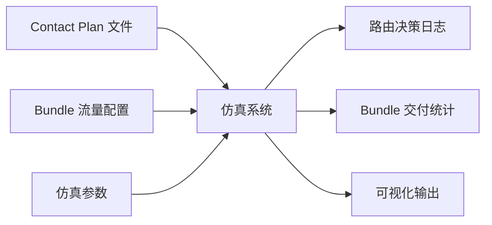
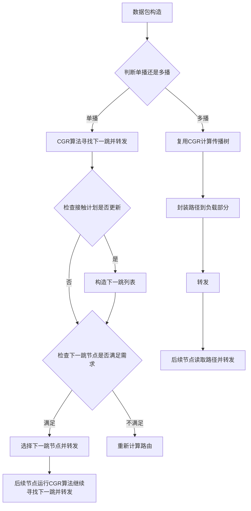
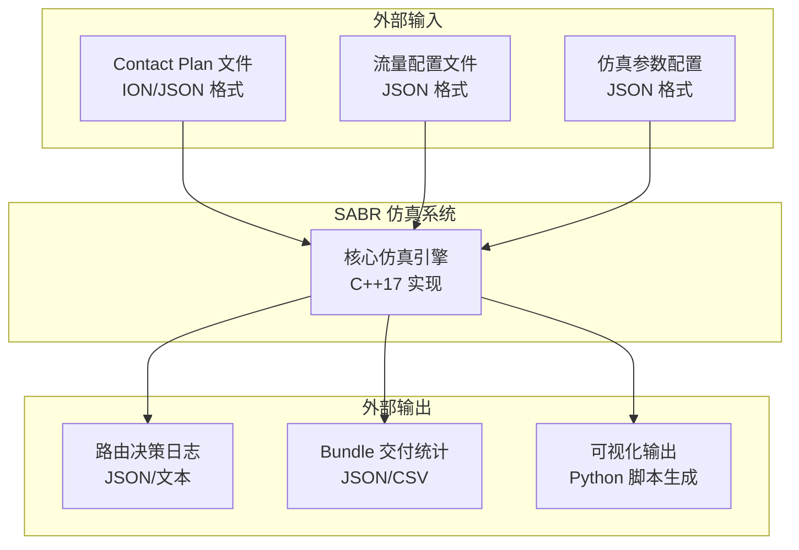
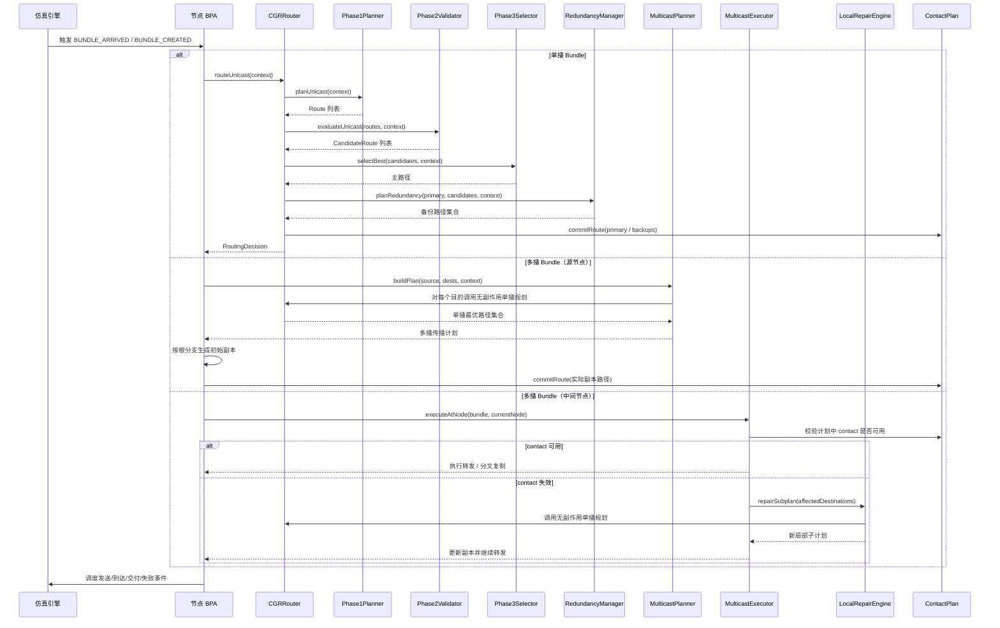
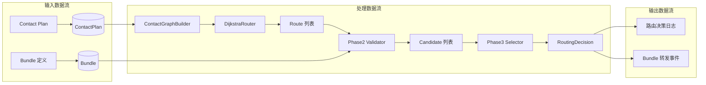
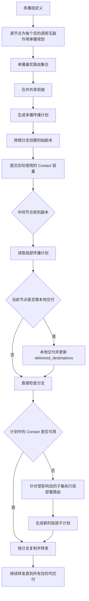
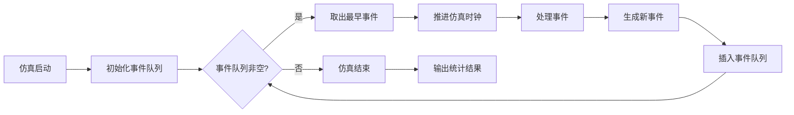

# 空间DTN网络 CGR/SABR 仿真系统 — 需求规格说明书


| 项目名称 | sabr |
|---|---|
| 版本 | v1.0 |
| 日期 | 2026-03-30 |
| 状态 | 初稿 |

---

## 目录

1. [引言](#1-引言)
2. [总体描述](#2-总体描述)
3. [数据结构需求](#3-数据结构需求)
4. [功能需求](#4-功能需求)
5. [多播路由需求](#5-多播路由需求)
6. [仿真引擎需求](#6-仿真引擎需求)
7. [输入/输出需求](#7-输入输出需求)
8. [非功能需求](#8-非功能需求)
9. [验证与测试需求](#9-验证与测试需求)
10. [术语表](#10-术语表)

---

## 1. 引言

### 1.1 目的

本文档定义"空间DTN网络CGR/SABR仿真系统"的软件需求规格。系统使用 C++ 在**逻辑层面**实现 CCSDS 734.3-B-1 标准所规定的 Schedule-Aware Bundle Routing (SABR) 算法，并在此基础上扩展**多播路由**能力。

### 1.2 范围

本系统是一个**离散事件仿真器**，不涉及真实网络协议栈、操作系统接口或物理链路实现。仿真对象为：

- 基于接触计划（Contact Plan）的时变网络拓扑
- Bundle 数据包的生成、路由决策、转发与交付
- 单播（Unicast）路由：完整实现 SABR 三阶段算法
- 多播（Multicast）路由：复用 CGR 构造传播树，将路径封装到数据包中，后续节点读取路径并转发

### 1.3 参考文献

| 编号 | 文献 |
|---|---|
| [REF-1] | CCSDS 734.3-B-1, *Schedule-Aware Bundle Routing*, Blue Book, July 2019 |
| [REF-2] | Caini, C., De Cola, G.M., Persampieri, L. (2021). *Schedule-Aware Bundle Routing: Analysis and Enhancements.* Int J Satell Commun Network, 39(3), 237-249 |

### 1.4 术语约定

- **SHALL / 必须**：强制性需求
- **SHOULD / 应当**：推荐性需求
- **MAY / 可以**：可选需求

---

## 2. 总体描述

### 2.1 系统上下文



### 2.2 系统架构概览

系统由以下核心模块组成：

```markmap
# SABR 仿真系统

## 数据模型层
- Contact Plan（接触计划）
- Contact（接触）
- Range Interval（距离区间）
- Node（DTN节点）
- Bundle（数据包）
- Route（路由）

## 算法层
- Contact Graph Builder（接触图构造器）
- Phase 1: Route Computation（路由计算）
- Phase 2: Route Validation（路由验证）
- Phase 3: Route Selection & Forwarding（路由选择与转发）
- Multicast Tree Builder（多播树构造器）

## 仿真引擎层
- 离散事件调度器
- 节点 BPA 代理
- 流量生成器

## 输入/输出层
- Contact Plan 解析器
- 流量配置解析器
- 日志与统计输出
- 可视化模块
```

### 2.3 核心工作流程

系统的核心路由决策流程如下（对应用户提供的流程图）：



---

## 3. 数据结构需求

### 3.1 接触（Contact）

> 对应 [REF-1] §2.3.1

| 需求ID | 描述 | 优先级 |
|---|---|---|
| DS-CON-01 | 每个 Contact 必须包含属性：`start_time`, `end_time`, `sending_node`, `receiving_node`, `data_rate` | 必须 |
| DS-CON-02 | Contact 的 `volume` 必须计算为 `(end_time - start_time) × data_rate` | 必须 |
| DS-CON-03 | 每个 Contact 必须维护按优先级分层的 MTV（Maximum Transmission Volume）计数器，初始值等于 `volume` | 必须 |
| DS-CON-04 | Contact 为单向的；双向通信由一对方向相反的 Contact 表示 | 必须 |
| DS-CON-05 | 当 `end_time ≤ current_time` 时，Contact 被视为已终止（terminated），应当从接触计划中移除 | 必须 |
| DS-CON-06 （新增）|每个 Contact 必须具有全局唯一的 contact_id，用于路由计划引用、日志记录与多播转发计划编码。|必须|
| DS-CON-07（新增） |每个 Contact 应记录所属 plan_version，用于检测路由计划与接触计划的一致性。|必须|

### 3.2 距离区间（Range Interval）

> 对应 [REF-1] §2.3.1

| 需求ID | 描述 | 优先级 |
|---|---|---|
| DS-RNG-01 | 每个 Range Interval 必须包含属性：`start_time`, `end_time`, `node_a`, `node_b`, `distance_light_seconds` | 必须 |
| DS-RNG-02 | Range Interval 是双向的：A-B 和 B-A 的距离相同 | 必须 |

### 3.3 接触计划（Contact Plan）

| 需求ID | 描述 | 优先级 |
|---|---|---|
| DS-CP-01 | Contact Plan 必须包含一组 Contact 和一组 Range Interval | 必须 |
| DS-CP-02 | 系统必须支持在仿真运行过程中动态修改 Contact Plan（增加/删除 Contact） | 应当 |
| DS-CP-03（修改） | Contact Plan 在发生增加、删除或属性更新时，必须递增单调版本号 plan_version | 必须 |
| DS-CP-04（新增） | 节点缓存的路由列表必须与生成时的 plan_version 绑定；当 plan_version 不一致时，缓存必须失效。 | 必须 |

### 3.4 DTN 节点（Node）

| 需求ID | 描述 | 优先级 |
|---|---|---|
| DS-NOD-01 | 每个 Node 必须由唯一的 `node_number`（正整数）标识 | 必须 |
| DS-NOD-02 | 每个 Node 必须维护本地路由表（Routing Table），即按目的节点索引的路由列表（Route List）集合 | 必须 |
| DS-NOD-03 | 每个 Node 必须维护按邻居节点和优先级组织的发送队列 | 必须 |
| DS-NOD-04 | 每个 Node 必须持有对全局 Contact Plan 的引用（假设所有节点共享同一接触计划） | 必须 |
| DS-NOD-05 | 每个 Node 必须维护排除邻居列表（Excluded Neighbors List） | 必须 |

### 3.5 Bundle（数据包）

> 对应 [REF-1] §1.4, §2.4

| 需求ID | 描述 | 优先级 |
|---|---|---|
| DS-BDL-01 | 每个 Bundle 必须包含属性：`source_node`, `destination_eid`, `creation_time`, `ttl`, `payload_size`, `header_size`, `priority`, `is_critical`, `is_multicast`, `allow_fragmentation` | 必须 |
| DS-BDL-02 | `expiration_time` 必须计算为 `creation_time + ttl` | 必须 |
| DS-BDL-03 | EVC（Estimated Volume Consumption）必须计算为 `header_size + payload_size + max(0.03 × (header_size + payload_size), 100)` | 必须 |
| DS-BDL-04 | 每个 Bundle 必须维护 `previous_node` 属性，记录上一跳节点 | 必须 |
| DS-BDL-05（修改） | 多播 Bundle 必须额外包含：(a) pending_destinations；(b) delivered_destinations；(c) multicast_plan（局部传播计划）；(d) encoded_plan_version；(e) replica_id、origin_bundle_id、parent_bundle_id | 必须 |
| DS-BDL-06 | 系统应当支持 Bundle 的优先级分为至少三个等级：Bulk（低）、Normal（中）、Expedited（高） | 必须 |
| DS-BDL-07 | 系统应当支持 Critical 标志，标记为 critical 的 Bundle 采用受控泛洪策略 | 必须 |
|DS-BDL-08（新增）|Bundle 必须支持维护 visited_nodes 列表，以支持反应式/主动式防环路增强| 必须 |
|DS-BDL-09（新增）|多播 Bundle 的 EVC 计算必须包含传播计划编码开销| 必须 |

### 3.6 路由（Route）

> 对应 [REF-1] §1.4, §2.3.2

| 需求ID | 描述 | 优先级 |
|---|---|---|
| DS-RTE-01 | Route 必须表示为一个有序的 Contact 序列，满足：(a) 首个 Contact 的发送节点为本地节点；(b) 末个 Contact 的接收节点为目的节点；(c) 第 i 个 Contact 的接收节点为第 i+1 个 Contact 的发送节点；(d) 第 i+1 个 Contact 的结束时间不早于第 i 个 Contact 的开始时间 | 必须 |
| DS-RTE-02 | Route 必须记录 `best_case_delivery_time`（最佳情况交付时间） | 必须 |
| DS-RTE-03 | Route 必须记录 `termination_time`（路由终止时间），为所有 Contact 中最早的 `end_time` | 必须 |
| DS-RTE-04 | Route 必须记录 `entry_node`（入口节点），即首个 Contact 的接收节点 | 必须 |
| DS-RTE-05 | Route 必须能够计算 PBAT（Projected Bundle Arrival Time），该计算依赖于具体 Bundle 的属性 | 必须 |
| DS-RTE-06 | Route 必须能够计算 RVL（Route Volume Limit），为所有 Contact 的 EVL 的最小值 | 必须 |
| DS-RTE-07（新增） | Route 中的每个 Contact 段必须记录与该段相关的时序信息，包括 earliest_transmission_time、earliest_arrival_time |必须 |
| DS-RTE-08（新增） | Route 应支持逐段记录 EVL，以便用于调试、多播计划生成和日志输出 | 必须 |
---

## 4. 功能需求 — 单播 SABR 路由

### 4.1 接触图构造

> 对应 [REF-1] §3.2.1

| 需求ID | 描述 | 优先级 |
|---|---|---|
| FR-CG-01 | 系统必须能够根据 Contact Plan 为指定目的节点 D 构造接触图（Contact Graph） | 必须 |
| FR-CG-02 | 接触图为有向无环图（DAG），顶点为 Contact，边为节点处的数据滞留（等待后续 Contact 开始） | 必须 |
| FR-CG-03 | 接触图必须包含根顶点（本地节点到自身的虚拟 Contact）和终端顶点（目的节点到自身的虚拟 Contact） | 必须 |

### 4.2 接触计划检查

> 对应 [REF-1] §3.2.2

| 需求ID | 描述 | 优先级 |
|---|---|---|
| FR-CPC-01 | 若接触计划中不存在任何向目的节点 D 传输的 Contact，则 CGR 不适用，应回退到补充路由程序 | 必须 |

### 4.3 路由修剪

> 对应 [REF-1] §3.2.3

| 需求ID | 描述 | 优先级 |
|---|---|---|
| FR-RP-01 | 若接触计划自上次路由计算以来发生任何修改，必须丢弃所有路由列表 | 必须 |
| FR-RP-02 | 所有 `end_time` 已过的 Contact 必须从接触计划中删除 | 必须 |

### 4.4 Phase 1：路由计算

> 对应 [REF-1] §3.2.4, [REF-2] §III.B

| 需求ID | 描述 | 优先级 |
|---|---|---|
| FR-P1-01（修改） | 系统必须实现基于 Dijkstra 框架的接触图最早到达路径搜索。搜索过程中，顶点松弛所使用的代价必须根据前驱到达时刻动态计算后继 Contact 的最早传输时间与最早到达时间，而非使用固定静态边权。 | 必须 |
| FR-P1-02 | 最早传输时间（Earliest Transmission Time）的计算：对于本地节点出发的 Contact，取 `max(contact.start_time, current_time)`；对于其他 Contact，取 `max(contact.start_time, 前一 Contact 的最早到达时间)` | 必须 |
| FR-P1-03 | 最早到达时间（Earliest Arrival Time）的计算：`earliest_transmission_time + distance_light_seconds + owlt_margin` | 必须 |
| FR-P1-04 | 不得将 `end_time < earliest_transmission_time` 的 Contact 纳入路由 | 必须 |
| FR-P1-05 | Phase 1 的计算不依赖于 Bundle 的具体属性（大小、优先级等），仅依赖于接触图结构 | 必须 |
| FR-P1-06 | 系统必须支持 Yen's K-Shortest Paths 算法，以便在需要时计算多条路由 | 必须 |
| FR-P1-07（修改） | 对于同一节点 X 到同一目的节点 D 的路由请求，若当前 plan_version 未变化且本地路由缓存非空，则可以跳过 Phase 1| 必须 |
| FR-P1-08（修改） | 若 Phase 2 无法从该节点本地缓存路由列表中找到候选路由，则必须重新进入 Phase 1 计算额外路由。 | 必须 |

### 4.5 Phase 2：路由验证（候选路由列表填充）

> 对应 [REF-1] §3.2.5, §3.2.6, [REF-2] §III.C

| 需求ID | 描述 | 优先级 |
|---|---|---|
| FR-P2-01 | 系统必须初始化空的候选路由列表（Candidate Routes List） | 必须 |
| FR-P2-02 | 系统必须构造排除节点列表（Excluded Nodes List）：(a) 若非因监护拒绝而重新转发，则将 `previous_node` 加入排除列表；(b) 将所有排除邻居加入排除列表 | 必须 |
| FR-P2-03 | **最早传输机会（ETO）计算**：必须按照 [REF-1] §3.2.6.2 的完整定义计算，包括：adjusted start time、applicable backlog、applicable prior contact volume、applicable backlog relief、residual backlog、backlog lien、earliest transmission opportunity | 必须 |
| FR-P2-04 | **PBAT 计算**：必须按照 [REF-1] §3.2.6.3-3.2.6.7 计算，包括 first byte transmission time、last byte transmission time、first byte arrival time、last byte arrival time，最终得到 projected bundle arrival time | 必须 |
| FR-P2-05 | **MTV / EVL / RVL 计算**：必须按照 [REF-1] §3.2.6.8 计算每个 Contact 的 MTV、EVL 和整条路由的 RVL | 必须 |
| FR-P2-06 | 必须执行以下排除规则，不满足条件的路由不得进入候选列表：| 必须 |

**排除规则明细（FR-P2-06 子项）：**

| 子项 | 排除条件 | 对应标准 |
|---|---|---|
| FR-P2-06a | best_case_delivery_time > bundle.expiration_time | §3.2.6.9(a) |
| FR-P2-06b | entry_node ∈ excluded_nodes_list | §3.2.6.9(b) |
| FR-P2-06c | 路由中包含向本地节点 X 传输的 Contact（除非 D = X） | §3.2.6.9(c) |
| FR-P2-06d | earliest_transmission_opportunity > 初始 Contact 的 end_time | §3.2.6.9(d) |
| FR-P2-06e | PBAT > bundle.expiration_time | §3.2.6.9(e) |
| FR-P2-06f | 路由在 bundle 优先级下已耗尽（RVL ≤ 0） | §3.2.6.9(f) |
| FR-P2-06g | 若 bundle 不允许分片，且 RVL < bundle.EVC | §3.2.6.9(g) |

| 需求ID | 描述 | 优先级 |
|---|---|---|
| FR-P2-07 | 若候选路由列表为空，必须重新进入 Phase 1 计算新路由；若无法计算更多路由，则路由选择失败 | 必须 |
| FR-P2-08 | 对于 Critical Bundle，必须确保为每个可达邻居都至少有一条候选路由 | 必须 |

### 4.6 Phase 3：路由选择与转发

> 对应 [REF-1] §3.2.7, §3.2.8, [REF-2] §III.D

| 需求ID | 描述 | 优先级 |
|---|---|---|
| FR-P3-01 | 若候选路由列表为空，CGR 路由失败，应回退到补充路由程序 | 必须 |
| FR-P3-02 | **标准 Bundle 的最佳路由选择**必须按以下优先级顺序依次比较：(1) 最小 PBAT；(2) 最少 Contact 数量；(3) 最晚 termination_time；(4) 最小 entry_node 编号 | 必须 |
| FR-P3-03 | 标准 Bundle 必须仅转发到最佳候选路由的 entry_node，不进行复制 | 必须 |
| FR-P3-04 | **Critical Bundle** 必须向每个拥有候选路由的邻居节点各发送一份副本（受控泛洪） | 必须 |
| FR-P3-05（修改） | 仅当 Bundle 已完成路由选择并确定实际发送副本后，系统才可对相应路由上的 Contact 扣减 MTV；Phase 1 和 Phase 2 的规划计算不得产生容量副作用 | 必须 |
| FR-P3-06 | 系统可以支持预期分片（Anticipatory Fragmentation） | 可以 |

### 4.7 逐跳重计算

> 对应 [REF-2] §III.E

| 需求ID | 描述 | 优先级 |
|---|---|---|
| FR-RR-01 | Bundle 到达下一跳节点后，必须由该节点重新从头执行完整的 SABR 路由决策（三阶段），而非沿用源节点计算的路由 | 必须 |

### 4.8 增强功能（来自 Caini et al. 2021）

> 对应 [REF-2] §IV

| 需求ID | 描述 | 优先级 |
|---|---|---|
| FR-ENH-01 | **One-Route-Per-Neighbor 增强**：Phase 1 应当为每个邻居节点至少计算一条路由（而非仅计算一条全局最优路由），以增加 Phase 3 中候选路由的多样性 | 应当 |
| FR-ENH-02 | **Queue-Delay 增强**：Phase 2 的 PBAT 计算中，对于首个 Contact 之后的每个 Contact，应当加入预期排队延迟（已分配字节数 / 传输速率），以提高 PBAT 准确性 | 应当 |
| FR-ENH-03 | **Anti-Loop 反应式增强**：Bundle 应当携带已访问节点列表（RGR 扩展）；当检测到 Bundle 已形成环路时，应将其转发到不同的邻居 | 应当 |
| FR-ENH-04 | **Anti-Loop 主动式增强**：Phase 2 中，若计算路由的某个 Contact 的端节点出现在 Bundle 的已访问节点列表中，则该路由应标记为"可能闭环"；Phase 3 中，仅当不存在其他非闭环候选路由时才选择该路由 | 应当 |
| FR-ENH-05 | 每项增强功能必须可独立启用/禁用（通过配置开关） | 必须 |

---

## 5. 多播路由需求

### 5.1 概述

CCSDS 734.3-B-1 标准明确指出 SABR 仅适用于单播（singleton endpoint）。本系统在标准基础上**扩展**多播能力，核心思路为：**在源节点复用 CGR 算法构造多播传播计划，将路径信息封装到 Bundle 负载中，后续节点读取路径信息进行转发**。

### 5.2 多播组定义

| 需求ID | 描述 | 优先级 |
|---|---|---|
| FR-MC-01 | 系统必须支持定义多播组（Multicast Group），每个组由一个唯一的 `group_id` 和一组目的节点 `member_nodes` 组成 | 必须 |
| FR-MC-02 | 系统必须支持在仿真运行前和运行中动态管理多播组的成员 | 应当 |

### 5.3 多播传播树构造

> 对应用户流程图：多播分支 → 复用CGR计算传播树

| 需求ID | 描述 | 优先级 |
|---|---|---|
| FR-MT-01（修改） | 源节点在发送多播 Bundle 时，必须为多播组中的每个目的节点调用无副作用的单播路由规划接口计算单播最佳路由；该过程不得修改 Contact 的 MTV | 必须 |
| FR-MT-02 | 系统必须将所有单播路由合并为多播传播计划（Multicast Dissemination Plan），其中共享前缀的路由段合并为同一分支 | 必须 |
| FR-MT-03 | 传播树的构造算法：(a) 以源节点为根；(b) 对每个目的节点的最佳路由，沿路由的 Contact 序列逐跳加入树中；(c) 当多条路由经过同一中间节点时，在该节点处分叉 | 必须 |
| FR-MT-04 | 传播树必须记录每个分叉节点（Branching Node）及其对应的下一跳列表和各下一跳负责的目的节点子集 | 必须 |

### 5.4 路径封装与转发

> 对应用户流程图：封装到数据包 → 转发 → 后续节点读取路径并转发

| 需求ID | 描述 | 优先级 |
|---|---|---|
| FR-MF-01 | 源节点必须将完整的多播传播树信息编码后封装到 Bundle 的扩展块或负载头部中 | 必须 |
| FR-MF-02（修改） | 传播计划编码格式必须包含：
(a) 当前节点标识；
(b) 每个分支对应的 contact_id 或等价 Contact 描述；
(c) 对应下一跳节点；
(d) 该分支负责的目的节点子集。 | 必须 |
| FR-MF-03 | 源节点根据传播树的第一层分支，向每个不同的下一跳邻居发送一份 Bundle 副本（仅在分叉点进行复制） | 必须 |
| FR-MF-04 | 每份 Bundle 副本中的传播树信息应当裁剪为仅包含该副本所负责的子树 | 应当 |
| FR-MF-05（修改） | 中间节点收到多播 Bundle 后，必须读取封装的传播计划并执行如下流程：
(a) 判断当前节点是否属于计划中的交付节点；若是，则本地交付；
(b) 对计划中的每个待执行分支，验证指定 Contact 在当前时刻是否仍可用；
(c) 若可用，则按计划复制并转发；
(d) 若不可用，则必须针对受影响的目的节点子集触发局部重路由，并更新该副本携带的局部传播计划 | 必须 |
| FR-MF-06 | 目的节点收到多播 Bundle 后，必须交付给本地应用（不再转发） | 必须 |
|FR-MF-07（新增） |多播传播计划中，共享前缀上的 Contact 只应按实际发送副本数扣减一次容量；仅在分叉点发生复制后，各子分支分别扣减容量 | 必须 |

### 5.5 多播容错

| 需求ID | 描述 | 优先级 |
|---|---|---|
| FR-MR-01（修改） | 若中间节点发现传播树中指定的下一跳 Contact 已失效（已终止或不可用），应当为受影响的目的节点子集重新调用 CGR 计算替代路由 | 必须 |
| FR-MR-02（修改） | 重新计算的路由应当更新到 Bundle 的传播树信息中 | 必须 |

---

## 6. 仿真引擎需求

### 6.1 离散事件仿真

| 需求ID | 描述 | 优先级 |
|---|---|---|
| FR-SIM-01 | 系统必须实现基于优先级队列的离散事件仿真引擎，按事件时间戳顺序处理事件 | 必须 |
| FR-SIM-02 | 系统必须支持以下事件类型：| 必须 |

**事件类型明细：**

| 事件类型 | 描述 |
|---|---|
| `BUNDLE_CREATED` | 新 Bundle 在源节点生成 |
| `BUNDLE_ARRIVED` | Bundle 到达某节点（经过传播延迟后） |
| `BUNDLE_FORWARDED` | Bundle 从某节点发送队列开始传输 |
| `BUNDLE_DELIVERED` | Bundle 到达最终目的节点并交付 |
| `BUNDLE_EXPIRED` | Bundle 的 TTL 到期 |
| `CONTACT_START` | 某个 Contact 开始生效 |
| `CONTACT_END` | 某个 Contact 结束 |
| `ROUTE_FAILED` | 路由失败（无候选路由） |

| 需求ID | 描述 | 优先级 |
|---|---|---|
| FR-SIM-03 | 仿真时钟必须为逻辑时间（非实时），支持快速推进 | 必须 |
| FR-SIM-04 | 系统必须支持配置仿真的起始时间和结束时间 | 必须 |

### 6.2 节点 BPA 代理

| 需求ID | 描述 | 优先级 |
|---|---|---|
| FR-BPA-01 | 每个 Node 必须实现一个 BPA（Bundle Protocol Agent）代理，负责：接收 Bundle → 执行 SABR 路由决策 → 入队转发或交付 | 必须 |
| FR-BPA-02 | BPA 必须按优先级处理发送队列中的 Bundle：高优先级 Bundle 先发送 | 必须 |
| FR-BPA-03 | BPA 在转发 Bundle 时，必须计算传输延迟（`bundle.EVC / contact.data_rate`）和传播延迟（`distance_light_seconds + owlt_margin`），并在相应时间后触发 `BUNDLE_ARRIVED` 事件 | 必须 |

### 6.3 流量生成器

| 需求ID | 描述 | 优先级 |
|---|---|---|
| FR-TG-01 | 系统必须支持通过配置文件定义流量模式：指定源节点、目的节点（单播）或多播组、生成时间、Bundle 大小、优先级、TTL 等 | 必须 |
| FR-TG-02 | 系统应当支持批量生成模式：在指定时间一次性生成 N 个 Bundle | 应当 |
| FR-TG-03 | 系统应当支持周期生成模式：按固定间隔持续生成 Bundle | 应当 |

---

## 7. 输入/输出需求

### 7.1 输入

| 需求ID | 描述 | 优先级 |
|---|---|---|
| IO-IN-01 | 系统必须支持从文本文件（ION 格式或 JSON 格式）读取 Contact Plan | 必须 |
| IO-IN-02 | ION 格式 Contact 定义：`a contact +<start> +<end> <from_node> <to_node> <data_rate>` | 必须 |
| IO-IN-03 | ION 格式 Range 定义：`a range +<start> +<end> <node_a> <node_b> <distance_light_seconds>` | 必须 |
| IO-IN-04 | 系统必须支持从配置文件读取仿真参数（OWLT margin、仿真时间范围等） | 必须 |
| IO-IN-05 | 系统必须支持从配置文件读取流量定义和多播组定义 | 必须 |

### 7.2 输出

| 需求ID | 描述 | 优先级 |
|---|---|---|
| IO-OUT-01 | 系统必须输出每个 Bundle 的完整路由决策日志，包括：在每个节点执行的 Phase 1/2/3 的详细信息（计算的路由、候选路由、选择的路由、PBAT、RVL 等） | 必须 |
| IO-OUT-02 | 系统必须输出 Bundle 交付统计：交付率、端到端延迟（创建到交付）、跳数、路由路径 | 必须 |
| IO-OUT-03 | 系统应当输出每个 Contact 的容量利用率统计 | 应当 |
| IO-OUT-04 | 系统应当支持以 JSON 格式导出所有统计数据 | 应当 |
| IO-OUT-05 | 系统应当支持可视化输出：网络拓扑图、时间线图（Bundle 生成/到达/交付时间序列）、Contact 利用率图 | 应当 |

---

## 8. 非功能需求

### 8.1 技术约束

| 需求ID | 描述 | 优先级 |
|---|---|---|
| NF-TC-01 | 系统必须使用 C++17 标准实现 | 必须 |
| NF-TC-02 | 核心算法模块不得依赖除 C++ 标准库之外的第三方库；可视化和数据分析模块可以使用外部 Python 脚本或第三方库（如 matplotlib、plotly） | 应当 |
| NF-TC-03 | 系统必须采用面向对象设计，核心数据结构和算法封装为独立的类和模块 | 必须 |

### 8.2 性能

| 需求ID | 描述 | 优先级 |
|---|---|---|
| NF-PF-01 | 系统应当能在合理时间内（< 60秒）完成包含 20 个节点、200 个 Contact、1000 个 Bundle 的仿真场景 | 应当 |
| NF-PF-02 | Dijkstra / Yen's K 算法的实现应当使用高效的数据结构（优先级队列/堆） | 应当 |

### 8.3 可维护性

| 需求ID | 描述 | 优先级 |
|---|---|---|
| NF-MT-01 | 代码必须有清晰的模块划分，每个模块职责单一 | 必须 |
| NF-MT-02 | 关键算法步骤必须有注释，注明对应的标准条款编号 | 必须 |
| NF-MT-03 | 系统应当提供完整的 API 文档（Doxygen 格式） | 应当 |

### 8.4 可扩展性

| 需求ID | 描述 | 优先级 |
|---|---|---|
| NF-EX-01 | 路由算法应当设计为可插拔的策略模式，便于未来替换或扩展路由算法 | 应当 |
| NF-EX-02 | 仿真引擎应当与路由算法解耦，支持独立测试路由算法 | 应当 |

---

## 9. 验证与测试需求

### 9.1 单元测试

| 需求ID | 描述 | 优先级 |
|---|---|---|
| VT-UT-01 | 必须为 Contact Plan 解析器编写单元测试 | 必须 |
| VT-UT-02 | 必须为 EVC、PBAT、ETO、MTV、EVL、RVL 的计算逻辑编写单元测试 | 必须 |
| VT-UT-03 | 必须为 Dijkstra 最短路径搜索编写单元测试，使用 [REF-1] §3.2.1 中的示例拓扑（图 3-1 至 3-4）进行验证 | 必须 |
| VT-UT-04 | 必须为 Phase 2 的每条排除规则编写独立的单元测试 | 必须 |
| VT-UT-05 | 必须为 Phase 3 的四级比较规则编写单元测试 | 必须 |
| VT-UT-06 | 必须为多播传播树构造逻辑编写单元测试 | 必须 |
| VT-UT-07（新增） | 验证 plan 与 commit 分离，确保多播构树阶段不修改 MTV | 必须 | 
| VT-UT-08（新增） | 验证多播共享前缀仅扣减一次容量 | 必须 |

### 9.2 集成测试

| 需求ID | 描述 | 优先级 |
|---|---|---|
| VT-IT-01 | 必须使用 [REF-2] 中的参考场景（5节点：MCC、GS1、GS2、Orbiter、SA，参考 Contact Plan Table I）进行端到端集成测试 | 必须 |
| VT-IT-02 | 下行链路测试（SA → MCC）：验证在无增强时前10个 Bundle 经 GS2、后10个经 GS1 的行为 | 必须 |
| VT-IT-03 | 下行链路测试（SA → MCC）+ One-Route-Per-Neighbor 增强：验证 Bundle 在 GS1 和 GS2 之间交替分配 | 必须 |
| VT-IT-04 | 上行链路测试（MCC → SA）+ Queue-Delay 增强：验证 PBAT 准确性提升导致的负载均衡 | 必须 |
| VT-IT-05 | 上行链路测试（MCC → SA）+ Orbiter + Anti-Loop 增强：验证环路检测与预防机制 | 应当 |
| VT-IT-06 | 多播测试：验证传播树构造、路径封装、中间节点分叉转发、目的节点交付的完整流程 | 必须 |
| VT-IT-07（新增） | 验证中间节点在 Contact 失效后对受影响目的子集执行局部修复 | 必须 |
| VT-IT-08（新增） | 验证多播副本的 origin_bundle_id / parent_bundle_id / replica_id 链路追踪正确 | 必须 |

### 9.3 标准符合性验证

| 需求ID | 描述 | 优先级 |
|---|---|---|
| VT-SC-01 | 使用 [REF-1] 图 3-1 至 3-4 的示例拓扑，验证接触图构造的正确性 | 必须 |
| VT-SC-02 | 使用 [REF-1] PICS 表（Annex A）中列出的所有强制性条目，逐项检查实现的符合性 | 应当 |

---

## 10. 术语表

| 术语 | 英文 | 定义 |
|---|---|---|
| 接触 | Contact | 一段预期数据将由发送节点传输且大部分数据将被接收节点接收的时间区间 |
| 接触计划 | Contact Plan | 由一组 Contact 和一组 Range Interval 组成的计划信息 |
| 接触图 | Contact Graph | 以 Contact 为顶点、以节点处数据滞留为边的有向无环图 |
| 距离区间 | Range Interval | 两节点间距离在一段时间内保持在某值附近（误差不超过1光秒）的声明 |
| 路由 | Route | 从本地节点到目的节点的一个有序 Contact 序列 |
| 入口节点 | Entry Node | 路由中首个 Contact 的接收节点（即下一跳） |
| 路由终止时间 | Termination Time | 路由中所有 Contact 的最早结束时间 |
| 最早传输机会 | ETO | Earliest Transmission Opportunity，考虑队列积压后的最早可传输时间 |
| 预计到达时间 | PBAT | Projected Bundle Arrival Time，Bundle 经该路由到达目的节点的预计时间 |
| 估计容量消耗 | EVC | Estimated Volume Consumption，Bundle 大小加上估计的汇聚层开销 |
| 最大传输容量 | MTV | Maximum Transmission Volume，Contact 尚未分配的剩余容量 |
| 有效容量限制 | EVL | Effective Volume Limit，受前后 Contact 约束的实际可用容量 |
| 路由容量限制 | RVL | Route Volume Limit，路由中所有 Contact 的 EVL 最小值 |
| 单向光时余量 | OWLT Margin | 传输期间两节点间单向光时的最大变化量 |
| 传播树 | Dissemination Tree | 多播路由中，从源节点到所有目的节点的树形路由结构 |
| 受控泛洪 | Controlled Flooding | Critical Bundle 向所有可达邻居发送副本的策略 |

---


# 空间 DTN 网络 CGR/SABR 仿真系统 — 系统架构设计文档 (C++ 版本)

| 项目名称 | sabr |
|---|---|
| 版本 | v1.0 |
| 日期 | 2026-03-31 |
| 状态 | 初稿 |

---

## 目录

1. [概述](#1-概述)
2. [系统上下文与边界](#2-系统上下文与边界)
3. [逻辑架构设计](#3-逻辑架构设计)
4. [模块详细设计](#4-模块详细设计)
5. [数据流设计](#5-数据流设计)
6. [接口设计](#6-接口设计)
7. [关键技术决策](#7-关键技术决策)
8. [部署视图](#8-部署视图)
9. [开发路线图](#9-开发路线图)

---

## 1. 概述

### 1.1 文档目的

本文档定义"空间DTN网络CGR/SABR仿真系统"的软件架构设计，作为实现阶段的顶层技术指导。系统架构设计遵循需求规格说明书中的功能需求和非功能需求，确保设计满足 CCSDS 734.3-B-1 标准的 SABR 算法要求。

### 1.2 设计目标

| 目标 | 说明 |
|---|---|
| **正确性** | 精确实现 SABR 三阶段路由算法，与标准条款一一对应 |
| **性能** | C++ 实现确保高效内存管理和计算性能 |
| **可扩展性** | 支持增强功能（Caini et al. 2021）的可插拔配置 |
| **可测试性** | 模块间松耦合，支持单元测试和集成测试 |
| **可维护性** | 清晰的模块划分，代码注释与标准条款对应 |

### 1.3 参考资料

| 编号 | 文献 |
|---|---|
| [REF-1] | CCSDS 734.3-B-1, *Schedule-Aware Bundle Routing*, Blue Book, July 2019 |
| [REF-2] | Caini, C., De Cola, G.M., Persampieri, L. (2021). *Schedule-Aware Bundle Routing: Analysis and Enhancements.* |
| [REQ] | 《空间DTN网络 CGR/SABR 仿真系统 — 需求规格说明书》 |

---

## 2. 系统上下文与边界

### 2.1 系统上下文图



### 2.2 系统边界定义

| 边界内 | 边界外 |
|---|---|
| C++ 离散事件仿真引擎 | 真实网络协议栈 |
| SABR 路由算法实现 | 操作系统网络接口 |
| Bundle 数据包处理逻辑 | 物理链路传输 |
| 接触计划解析器 | BP 协议完整实现 |
| 多播传播树构造 | 实际航天器硬件 |
| Python 可视化脚本（可选） | |

### 2.3 用户角色

| 角色 | 职责 |
|---|---|
| **仿真配置人员** | 编写 Contact Plan、流量配置、仿真参数 |
| **算法研究人员** | 分析路由决策日志，验证 SABR 行为 |
| **系统集成测试人员** | 执行参考场景测试，验证标准符合性 |
| **C++ 开发人员** | 维护核心算法模块，优化性能 |

---

## 3. 逻辑架构设计

### 3.1 分层架构概览

系统采用**四层分层架构 + 两条扩展控制链**，从上到下依次为：输入输出层、仿真引擎层、算法层、数据模型层。

与初版设计相比，架构在以下两点上进行了明确强化：

1. **单播路由采用“规划（Plan）—验证（Validate）—选择（Select）—提交（Commit）”分离式设计**。  
   其中，Phase 1 与 Phase 2 只进行无副作用规划和验证，不修改 Contact 的 MTV；只有在最终形成实际发送决策时，才执行资源提交。

2. **多播路由采用“源节点生成传播计划 + 中间节点按计划执行 + 计划失效时局部修复”的混合式设计**。  
   多播副本中携带的是局部传播计划而非单纯节点路径，中间节点收到副本后需要先校验计划中指定的 Contact 是否仍可用，再决定执行转发或触发局部重路由。

此外，为支持毕设创新点，算法层新增**冗余传输控制链**，用于在标准 SABR 路由决策之后、资源提交之前，为高风险 Bundle 选择一条或多条受控备份路径。

┌──────────────────────────────────────────────────────────────────────┐
│                         输入输出层 (IO Layer)                         │
│  ┌─────────────┐ ┌─────────────┐ ┌────────────────────────────────┐  │
│  │ 配置解析器   │ │ 路由决策日志 │ │ 统计分析 / 可视化 / 结果导出   │  │
│  │ Parser      │ │ Logger      │ │ Stats / Visualizer            │  │
│  └─────────────┘ └─────────────┘ └────────────────────────────────┘  │
├──────────────────────────────────────────────────────────────────────┤
│                       仿真引擎层 (Simulation Layer)                   │
│  ┌─────────────┐ ┌─────────────┐ ┌────────────────────────────────┐  │
│  │ 离散事件调度 │ │ 节点 BPA     │ │ 流量生成器 / 副本创建 / 去重   │  │
│  │ Scheduler   │ │ BPA Agent   │ │ Traffic / Replica Control     │  │
│  └─────────────┘ └─────────────┘ └────────────────────────────────┘  │
├──────────────────────────────────────────────────────────────────────┤
│                         算法层 (Algorithm Layer)                      │
│  ┌──────────┐ ┌──────────┐ ┌──────────┐ ┌────────────────────────┐ │
│  │ Phase 1  │ │ Phase 2  │ │ Phase 3  │ │ Commit / Resource      │ │
│  │ Planner  │ │Validator │ │Selector  │ │ Submission             │ │
│  └──────────┘ └──────────┘ └──────────┘ └────────────────────────┘ │
│  ┌──────────────┐ ┌──────────────┐ ┌────────────────────────────┐  │
│  │ ContactGraph │ │ Dijkstra /   │ │ Multicast Planner /        │  │
│  │ Builder      │ │ Yen KSP      │ │ Executor / Local Repair    │  │
│  └──────────────┘ └──────────────┘ └────────────────────────────┘  │
│  ┌────────────────────────┐ ┌────────────────────────────────────┐ │
│  │ Redundancy Manager     │ │ Enhancements                       │ │
│  │ (受控冗余传输)           │ │ One-Route / Queue-Delay / Loop   │ │
│  └────────────────────────┘ └────────────────────────────────────┘ │
├──────────────────────────────────────────────────────────────────────┤
│                        数据模型层 (Model Layer)                       │
│  ┌─────────┐ ┌─────────┐ ┌──────────┐ ┌─────────┐ ┌─────────────┐  │
│  │ Contact │ │ Contact │ │ Bundle / │ │ Route / │ │ NodeState / │  │
│  │         │ │ Plan    │ │ Mcast    │ │ Metrics │ │ Route Cache │  │
│  └─────────┘ └─────────┘ └──────────┘ └─────────┘ └─────────────┘  │
└──────────────────────────────────────────────────────────────────────┘


---

## 3.2 层间依赖关系


### 3.2 层间依赖关系

依赖方向保持“上层依赖下层”的基本原则，但在算法层内部进行如下约束：

- `Phase1Planner` 仅负责生成 Route 列表，不得依赖 Phase 2 或 Phase 3。
- `Phase2Validator` 仅负责依据 Bundle、ContactPlan、NodeState 对 Route 进行验证和打分，不得修改 Contact 的 MTV。
- `Phase3Selector` 仅从候选路由中做选择，不得直接入队或扣减容量。
- `CGRRouter` 作为编排器，负责组织 Phase1 / Phase2 / Phase3，并在最终调用 `commitRoute()` 时执行资源提交。
- `MulticastPlanner` 只能调用**无副作用的单播规划接口**。
- `MulticastExecutor` 只负责执行局部传播计划；当计划失效时，调用 `LocalRepairEngine` 重新生成局部子计划。
- `RedundancyManager` 位于 `Phase3Selector` 与 `commitRoute()` 之间，负责决定是否创建冗余副本及其备份路径。

这样可以保证：  
单播、多播、冗余三套机制共享同一套底层路由能力，但彼此不会在规划阶段相互污染容量状态。

---

### 3.3 核心组件交互图

以下交互图描述标准单播、多播执行以及冗余传输的统一工作流：



---

## 4. 模块详细设计

### 4.1 数据模型层

#### 4.1.1 Contact 模块

| 元素 | 定义 |
|---|---|
| **文件名** | `contact.hpp` / `contact.cpp` |
| **类名** | `Contact`, `RangeInterval`, `ContactRef` |
| **职责** | 表示单向通信接触；维护唯一标识、版本号和优先级分层容量 |
| **核心属性** | `contact_id`, `from_node`, `to_node`, `start_time`, `end_time`, `data_rate`, `base_volume`, `plan_version` |
| **方法** | `isActive()`, `isExpired()`, `remainingMtv()`, `consume()` |
| **对应需求** | DS-CON-01 ~ DS-CON-07 |

```cpp
#pragma once
#include <array>
#include <cstdint>
#include <memory>
#include "priority.hpp"

namespace sabr {

using NodeId = uint32_t;
using ContactId = uint64_t;
using PlanVersion = uint64_t;
using TimePoint = double;
using Volume = double;

struct ContactRef {
    ContactId id;
    NodeId from;
    NodeId to;
    TimePoint start;
    TimePoint end;
};

class Contact {
public:
    Contact(ContactId id,
            NodeId from,
            NodeId to,
            TimePoint start,
            TimePoint end,
            double data_rate,
            PlanVersion version);

    ContactId id() const noexcept { return id_; }
    NodeId fromNode() const noexcept { return from_; }
    NodeId toNode() const noexcept { return to_; }
    TimePoint startTime() const noexcept { return start_; }
    TimePoint endTime() const noexcept { return end_; }
    double dataRate() const noexcept { return data_rate_; }
    Volume baseVolume() const noexcept { return base_volume_; }
    PlanVersion planVersion() const noexcept { return version_; }

    bool isActive(TimePoint now) const noexcept;
    bool isExpired(TimePoint now) const noexcept;

    Volume remainingMtv(Priority p) const noexcept;
    void consume(Volume evc, Priority p);

    ContactRef ref() const noexcept {
        return ContactRef{id_, from_, to_, start_, end_};
    }

private:
    ContactId id_;
    NodeId from_;
    NodeId to_;
    TimePoint start_;
    TimePoint end_;
    double data_rate_;
    Volume base_volume_;
    PlanVersion version_;
    std::array<Volume, 3> mtv_;
};

struct RangeInterval {
    NodeId node_a;
    NodeId node_b;
    TimePoint start_time;
    TimePoint end_time;
    double distance_light_seconds;

    bool isActive(TimePoint t) const noexcept;
};

} // namespace sabr
```

---

#### 4.1.2 ContactPlan 模块

| 元素 | 定义 |
|---|---|
| **文件名** | `contact_plan.hpp` / `contact_plan.cpp` |
| **类名** | `ContactPlan` |
| **职责** | 管理 Contact、RangeInterval 与 `plan_version`；支持查询和版本失效 |
| **核心属性** | `contacts`, `ranges`, `plan_version` |
| **方法** | `addContact()`, `addRange()`, `removeExpired()`, `getContact()`, `getRange()`, `outgoingFrom()` |
| **对应需求** | DS-CP-01 ~ DS-CP-04 |

```cpp
#pragma once
#include <memory>
#include <optional>
#include <vector>
#include "contact.hpp"

namespace sabr {

class ContactPlan {
public:
    using ContactPtr = std::shared_ptr<Contact>;

    PlanVersion version() const noexcept { return version_; }

    void addContact(ContactPtr c);
    void addRange(const RangeInterval& r);
    void removeExpired(TimePoint now);

    ContactPtr getContact(ContactId id) const;
    std::optional<double> getRange(NodeId a, NodeId b, TimePoint t) const;

    std::vector<ContactPtr> outgoingFrom(NodeId node) const;
    std::vector<ContactPtr> incomingTo(NodeId node) const;
    std::vector<ContactPtr> contactsTo(NodeId dst) const;

    void bumpVersion() noexcept { ++version_; }

private:
    PlanVersion version_ = 0;
    std::vector<ContactPtr> contacts_;
    std::vector<RangeInterval> ranges_;
};

} // namespace sabr
```

---

#### 4.1.3 NodeState / BundleProtocolAgent / Node 模块

| 元素 | 定义 |
|---|---|
| **文件名** | `node_state.hpp`, `bpa.hpp`, `node.hpp` |
| **类名** | `RouteCacheKey`, `NodeState`, `BundleProtocolAgent`, `Node` |
| **职责** | 管理节点本地状态、排除邻居、版本绑定缓存、发送队列和 Bundle 生命周期 |
| **核心属性** | `excluded_neighbors`, `route_cache`, `send_queues` |
| **方法** | `findCachedRoutes()`, `storeRoutes()`, `onBundleArrived()`, `enqueueForContact()` |
| **对应需求** | DS-NOD-01 ~ DS-NOD-05, FR-P1-07, FR-P1-08 |

```cpp
#pragma once
#include <memory>
#include <optional>
#include <queue>
#include <unordered_map>
#include <unordered_set>
#include "bundle.hpp"
#include "route.hpp"

namespace sabr {

struct RouteCacheKey {
    NodeId local_node;
    NodeId destination;
    PlanVersion plan_version;

    bool operator==(const RouteCacheKey& other) const noexcept = default;
};

struct RouteCacheKeyHash {
    size_t operator()(const RouteCacheKey& key) const noexcept;
};

class SendQueue {
public:
    void enqueue(std::shared_ptr<Bundle> bundle, Priority priority);
    std::shared_ptr<Bundle> dequeue();
    bool empty() const noexcept;

private:
    std::queue<std::shared_ptr<Bundle>> expedited_;
    std::queue<std::shared_ptr<Bundle>> normal_;
    std::queue<std::shared_ptr<Bundle>> bulk_;
};

class NodeState {
public:
    explicit NodeState(NodeId node_id);

    NodeId nodeId() const noexcept { return node_id_; }

    void addExcludedNeighbor(NodeId n);
    void clearExcludedNeighbors();
    const std::unordered_set<NodeId>& excludedNeighbors() const noexcept;

    std::vector<Route>* findCachedRoutes(NodeId destination, PlanVersion version);
    void storeRoutes(NodeId destination, PlanVersion version, std::vector<Route> routes);
    void clearRouteCache();

private:
    NodeId node_id_;
    std::unordered_set<NodeId> excluded_neighbors_;
    std::unordered_map<RouteCacheKey, std::vector<Route>, RouteCacheKeyHash> route_cache_;
};

class ContactPlan;
class CGRRouter;
class MulticastPlanner;
class MulticastExecutor;

class BundleProtocolAgent {
public:
    BundleProtocolAgent(NodeId node_id,
                        NodeState& node_state,
                        CGRRouter& cgr_router,
                        MulticastPlanner& multicast_planner,
                        MulticastExecutor& multicast_executor);

    void onBundleCreated(std::shared_ptr<Bundle> bundle,
                         std::shared_ptr<ContactPlan> plan,
                         TimePoint now);

    void onBundleArrived(std::shared_ptr<Bundle> bundle,
                         std::shared_ptr<ContactPlan> plan,
                         TimePoint now);

    void enqueueForContact(std::shared_ptr<Bundle> bundle,
                           ContactId contact_id,
                           Priority priority);

    void deliverLocal(std::shared_ptr<Bundle> bundle);

private:
    void handleUnicast(std::shared_ptr<Bundle> bundle,
                       std::shared_ptr<ContactPlan> plan,
                       TimePoint now);

    void handleMulticast(std::shared_ptr<Bundle> bundle,
                         std::shared_ptr<ContactPlan> plan,
                         TimePoint now);

private:
    NodeId node_id_;
    NodeState& node_state_;
    CGRRouter& cgr_router_;
    MulticastPlanner& multicast_planner_;
    MulticastExecutor& multicast_executor_;
    std::unordered_map<NodeId, SendQueue> send_queues_;
};

struct Node {
    NodeId node_id;
    std::unique_ptr<NodeState> state;
    std::unique_ptr<BundleProtocolAgent> bpa;
};

} // namespace sabr
```

---

#### 4.1.4 Bundle / MulticastState 模块

你当前架构稿里的 `Bundle` 还停留在旧 `MulticastTree` 结构，且没有 `bundle_id / origin_bundle_id / parent_bundle_id / replica_id / visited_nodes`，和你已修改后的需求稿已经不一致了。:contentReference[oaicite:4]{index=4}


#### 4.1.4 Bundle / MulticastState 模块

| 元素 | 定义 |
|---|---|
| **文件名** | `bundle.hpp` / `bundle.cpp` |
| **类名** | `Bundle`, `MulticastState` |
| **职责** | 表示普通 Bundle 与多播副本；支持副本追踪、去重、防环路与传播计划挂载 |
| **核心属性** | `bundle_id`, `origin_bundle_id`, `parent_bundle_id`, `replica_id`, `visited_nodes`, `multicast_state` |
| **方法** | `evc()`, `isExpired()`, `markVisited()`, `cloneReplica()` |
| **对应需求** | DS-BDL-01 ~ DS-BDL-09 |

```cpp
#pragma once
#include <cstdint>
#include <memory>
#include <optional>
#include <unordered_set>
#include <vector>
#include "priority.hpp"

namespace sabr {

class MulticastPlanNode;

using BundleId = uint64_t;

struct MulticastState {
    uint32_t group_id = 0;
    std::unordered_set<NodeId> pending_destinations;
    std::unordered_set<NodeId> delivered_destinations;

    std::shared_ptr<MulticastPlanNode> local_plan_root;

    size_t encoded_plan_bytes = 0;
    PlanVersion encoded_plan_version = 0;
};

class Bundle {
public:
    Bundle(BundleId id,
           NodeId source,
           NodeId destination,
           TimePoint creation_time,
           TimePoint ttl,
           size_t payload_size,
           size_t header_size,
           Priority priority = Priority::NORMAL,
           bool is_critical = false,
           bool allow_fragmentation = true);

    BundleId id() const noexcept { return id_; }
    BundleId originBundleId() const noexcept { return origin_bundle_id_; }
    BundleId parentBundleId() const noexcept { return parent_bundle_id_; }
    uint32_t replicaId() const noexcept { return replica_id_; }

    NodeId sourceNode() const noexcept { return source_node_; }
    NodeId destinationEid() const noexcept { return destination_eid_; }
    NodeId currentNode() const noexcept { return current_node_; }
    NodeId previousNode() const noexcept { return previous_node_; }

    void setCurrentNode(NodeId n) noexcept { current_node_ = n; }
    void setPreviousNode(NodeId n) noexcept { previous_node_ = n; }

    TimePoint creationTime() const noexcept { return creation_time_; }
    TimePoint expirationTime() const noexcept { return expiration_time_; }
    bool isExpired(TimePoint now) const noexcept;

    Priority priority() const noexcept { return priority_; }
    bool isCritical() const noexcept { return is_critical_; }
    bool allowFragmentation() const noexcept { return allow_fragmentation_; }
    bool isMulticast() const noexcept { return multicast_state_.has_value(); }

    double evc() const noexcept;

    void markVisited(NodeId node);
    const std::vector<NodeId>& visitedNodes() const noexcept { return visited_nodes_; }

    void enableMulticast(MulticastState state);
    MulticastState& multicast() { return *multicast_state_; }
    const MulticastState& multicast() const { return *multicast_state_; }

    Bundle cloneReplica(BundleId new_id,
                        BundleId parent_id,
                        uint32_t replica_id) const;

private:
    BundleId id_;
    BundleId origin_bundle_id_;
    BundleId parent_bundle_id_;
    uint32_t replica_id_ = 0;

    NodeId source_node_;
    NodeId destination_eid_;
    NodeId current_node_ = 0;
    NodeId previous_node_ = 0;

    TimePoint creation_time_;
    TimePoint expiration_time_;

    size_t payload_size_;
    size_t header_size_;
    Priority priority_;
    bool is_critical_;
    bool allow_fragmentation_;

    std::vector<NodeId> visited_nodes_;
    std::optional<MulticastState> multicast_state_;
};

} // namespace sabr
```

---

#### 4.1.5 Route / CandidateRoute 模块


#### 4.1.5 Route / CandidateRoute 模块

| 元素 | 定义 |
|---|---|
| **文件名** | `route.hpp` / `route.cpp` |
| **类名** | `RouteLeg`, `RouteMetrics`, `Route`, `CandidateRoute`, `RoutingDecision` |
| **职责** | 表示逐段接触路径、验证指标与候选路由结果 |
| **核心属性** | `legs`, `entry_node`, `termination_time`, `best_case_delivery_time`, `eto`, `pbat`, `rvl` |
| **方法** | `entryNode()`, `hopCount()` |
| **对应需求** | DS-RTE-01 ~ DS-RTE-08, FR-P2, FR-P3 |

```cpp
#pragma once
#include <optional>
#include <string>
#include <vector>
#include "bundle.hpp"
#include "contact.hpp"

namespace sabr {

struct RouteLeg {
    ContactRef contact;
    TimePoint earliest_tx_time = 0.0;
    TimePoint earliest_arrival_time = 0.0;
    Volume evl = 0.0;
};

struct RouteMetrics {
    NodeId entry_node = 0;
    TimePoint best_case_delivery_time = 0.0;
    TimePoint termination_time = 0.0;
    TimePoint eto = 0.0;
    TimePoint pbat = 0.0;
    Volume rvl = 0.0;
    size_t hop_count = 0;
    bool potential_loop = false;
};

class Route {
public:
    explicit Route(std::vector<RouteLeg> legs);

    const std::vector<RouteLeg>& legs() const noexcept { return legs_; }
    std::vector<RouteLeg>& legs() noexcept { return legs_; }

    const RouteMetrics& metrics() const noexcept { return metrics_; }
    RouteMetrics& metrics() noexcept { return metrics_; }

    NodeId entryNode() const noexcept { return metrics_.entry_node; }
    size_t hopCount() const noexcept { return metrics_.hop_count; }

private:
    std::vector<RouteLeg> legs_;
    RouteMetrics metrics_;
};

struct CandidateRoute {
    Route route;
    bool valid = false;
    std::string reject_reason;
};

enum class RoutingAction {
    FORWARD_ONE,
    FORWARD_FLOOD,
    DELIVER_LOCAL,
    ROUTE_FAIL
};

struct RoutingDecision {
    RoutingAction action = RoutingAction::ROUTE_FAIL;
    std::optional<CandidateRoute> chosen;
    std::vector<CandidateRoute> flood_set;
    std::vector<CandidateRoute> backup_set;
};

} // namespace sabr
```


### 4.2 算法层

#### 4.2.1 ContactGraph 模块

原来把 `Edge.weight` 定成“最早到达时间”，这和你现在需求稿里的动态松弛语义不匹配。架构里应该明确：图只描述**可连接关系**，最早到达时间在搜索时动态算。:contentReference[oaicite:5]{index=5}


#### 4.2.1 ContactGraph 模块

| 元素 | 定义 |
|---|---|
| **文件名** | `contact_graph.hpp` / `contact_graph.cpp` |
| **类名** | `Vertex`, `Edge`, `ContactGraph`, `ContactGraphBuilder` |
| **职责** | 根据 ContactPlan 构造接触图，表达 Contact 之间的时序可连接关系 |
| **输入** | `ContactPlan`, `source`, `destination`, `current_time` |
| **输出** | `ContactGraph` |
| **关键说明** | 图的边只表示可连接关系；最早传输时间/最早到达时间在 Dijkstra 松弛阶段动态计算 |
| **对应需求** | FR-CG-01 ~ FR-CG-03, FR-P1-01 |

```cpp
#pragma once
#include <memory>
#include <vector>
#include "models/contact_plan.hpp"

namespace sabr {

struct Vertex {
    enum class Type { ROOT, CONTACT, TERMINAL };
    Type type;
    ContactRef contact;
};

struct Edge {
    size_t from;
    size_t to;
};

class ContactGraph {
public:
    void addVertex(const Vertex& v);
    void addEdge(const Edge& e);

    const std::vector<Vertex>& vertices() const noexcept { return vertices_; }
    const std::vector<std::vector<Edge>>& adjacency() const noexcept { return adjacency_; }

    size_t rootIndex() const noexcept { return root_index_; }
    size_t terminalIndex() const noexcept { return terminal_index_; }

    void setRootIndex(size_t idx) noexcept { root_index_ = idx; }
    void setTerminalIndex(size_t idx) noexcept { terminal_index_ = idx; }

private:
    std::vector<Vertex> vertices_;
    std::vector<std::vector<Edge>> adjacency_;
    size_t root_index_ = 0;
    size_t terminal_index_ = 0;
};

class ContactGraphBuilder {
public:
    ContactGraph build(const ContactPlan& plan,
                       NodeId source,
                       NodeId destination,
                       TimePoint now) const;
};

} // namespace sabr
```

---

#### 4.2.2  Dijkstra 


#### 4.2.2 Dijkstra 模块

| 元素 | 定义 |
|---|---|
| **文件名** | `dijkstra.hpp` / `dijkstra.cpp` |
| **类名** | `DijkstraResult`, `DijkstraRouter` |
| **职责** | 在接触图上执行基于动态时序松弛的最早到达搜索 |
| **关键说明** | 搜索状态保存“到达当前顶点的最早时间”；松弛时根据前驱到达时间动态计算后继 Contact 的 ETT/EAT |
| **对应需求** | FR-P1-01 ~ FR-P1-04 |

```cpp
#pragma once
#include <optional>
#include <vector>
#include "contact_graph.hpp"
#include "models/route.hpp"

namespace sabr {

struct DijkstraResult {
    std::vector<TimePoint> arrival_times;
    std::vector<std::optional<size_t>> predecessors;
};

class DijkstraRouter {
public:
    DijkstraResult compute(const ContactGraph& graph,
                           size_t source_index,
                           const ContactPlan& plan,
                           TimePoint now,
                           double owlt_margin) const;

    std::optional<Route> extractRoute(const ContactGraph& graph,
                                      const DijkstraResult& result,
                                      size_t destination_index) const;
};

} // namespace sabr
```
---

#### 4.2.3  YenKSP

| 元素       | 定义                            |
| -------- | ----------------------------- |
| **文件名**  | `yen_ksp.hpp` / `yen_ksp.cpp` |
| **类名**   | `YenKShortestPaths`           |
| **职责**   | 在最早到达路径基础上生成若干备选路由            |
| **对应需求** | FR-P1-06                      |

```cpp
#pragma once
#include <vector>
#include "contact_graph.hpp"
#include "models/route.hpp"

namespace sabr {

class YenKShortestPaths {
public:
    std::vector<Route> compute(const ContactGraph& graph,
                               const ContactPlan& plan,
                               TimePoint now,
                               double owlt_margin,
                               size_t k) const;
};

} // namespace sabr
```

---

#### 4.2.4 Phase1Planner（替换原 4.2.4）


#### 4.2.4 Phase1Planner 模块

| 元素 | 定义 |
|---|---|
| **文件名** | `phase1_planner.hpp` / `phase1_planner.cpp` |
| **类名** | `RoutingContext`, `Phase1Planner` |
| **职责** | 无副作用生成单播路由列表 |
| **关键说明** | 本模块只生成 Route，不验证 Bundle 约束，不提交容量 |
| **对应需求** | FR-P1-01 ~ FR-P1-08 |

```cpp
#pragma once
#include <vector>
#include "contact_graph.hpp"
#include "dijkstra.hpp"
#include "yen_ksp.hpp"
#include "models/route.hpp"
#include "models/contact_plan.hpp"
#include "models/bundle.hpp"
#include "models/node_state.hpp"

namespace sabr {

struct RoutingContext {
    NodeId local_node;
    NodeId destination;
    TimePoint now;
    double owlt_margin;

    const ContactPlan* plan = nullptr;
    const Bundle* bundle = nullptr;
    const NodeState* node_state = nullptr;
};

class Phase1Planner {
public:
    std::vector<Route> enumerateRoutes(const RoutingContext& ctx,
                                       size_t k = 8,
                                       bool one_route_per_neighbor = false) const;

private:
    ContactGraphBuilder graph_builder_;
    DijkstraRouter dijkstra_;
    YenKShortestPaths yen_ksp_;
};

} // namespace sabr
```

---

#### 4.2.5 Phase2Validator（替换原 4.2.5）

原架构里 `Phase2RouteValidation::validateRoutes()` 仍返回 `vector<Route>`，这会把排除原因、PBAT、ETO、RVL、潜在闭环标记丢掉。现在应直接返回 `CandidateRoute`。:contentReference[oaicite:6]{index=6}


#### 4.2.5 Phase2Validator 模块

| 元素 | 定义 |
|---|---|
| **文件名** | `phase2_validator.hpp` / `phase2_validator.cpp` |
| **类名** | `Phase2Validator` |
| **职责** | 根据 Bundle、ContactPlan、NodeState 验证 Route，并输出带验证结果的候选路由 |
| **关键说明** | 本模块仍不修改 MTV，仅计算 ETO / PBAT / RVL 并应用排除规则 |
| **对应需求** | FR-P2-01 ~ FR-P2-08 |

```cpp
#pragma once
#include <vector>
#include "models/route.hpp"
#include "phase1_planner.hpp"

namespace sabr {

class Phase2Validator {
public:
    std::vector<CandidateRoute> validate(const std::vector<Route>& routes,
                                         const RoutingContext& ctx) const;

    CandidateRoute validateOne(const Route& route,
                               const RoutingContext& ctx) const;

private:
    TimePoint calculateEto(const Route& route,
                           const RoutingContext& ctx) const;

    TimePoint calculatePbat(const Route& route,
                            const RoutingContext& ctx) const;

    Volume calculateRvl(const Route& route,
                        const RoutingContext& ctx) const;

    bool rejectByExpiration(const Route& route, const RoutingContext& ctx) const;
    bool rejectByExcludedEntry(const Route& route, const RoutingContext& ctx) const;
    bool rejectByLoopToLocal(const Route& route, const RoutingContext& ctx) const;
    bool rejectByEto(const Route& route, TimePoint eto) const;
    bool rejectByPbat(TimePoint pbat, const RoutingContext& ctx) const;
    bool rejectByRvl(Volume rvl, const RoutingContext& ctx) const;
};

} // namespace sabr
```

---

#### 4.2.6 Phase3Selector（替换原 4.2.6）


#### 4.2.6 Phase3Selector 模块

| 元素 | 定义 |
|---|---|
| **文件名** | `phase3_selector.hpp` / `phase3_selector.cpp` |
| **类名** | `Phase3Selector` |
| **职责** | 从候选路由中选择主路径或泛洪集合 |
| **关键说明** | 本模块只做比较和选择，不负责资源提交 |
| **对应需求** | FR-P3-01 ~ FR-P3-04 |

```cpp
#pragma once
#include <optional>
#include <vector>
#include "models/route.hpp"
#include "phase1_planner.hpp"

namespace sabr {

class Phase3Selector {
public:
    std::optional<CandidateRoute> selectBest(const std::vector<CandidateRoute>& candidates,
                                             const RoutingContext& ctx) const;

    std::vector<CandidateRoute> selectFloodSet(const std::vector<CandidateRoute>& candidates,
                                               const RoutingContext& ctx) const;
};

} // namespace sabr
```

---

#### 4.2.7 CGRRouter（替换原 4.2.7）

前架构稿里的 `CGRRouter` 还维护 `destination -> route list` 的全局缓存，和修改后的需求稿冲突了。缓存必须在节点本地、并且绑定 `plan_version`。:contentReference[oaicite:7]{index=7}


#### 4.2.7 CGRRouter 模块

| 元素 | 定义 |
|---|---|
| **文件名** | `cgr_router.hpp` / `cgr_router.cpp` |
| **类名** | `CGRRouter` |
| **职责** | 编排 Phase1 / Phase2 / Phase3，并在最终阶段提交资源 |
| **关键说明** | `CGRRouter` 不再持有全局 route cache；缓存由 NodeState 维护 |
| **对应需求** | FR-P1, FR-P2, FR-P3, FR-RR-01 |

```cpp
#pragma once
#include <vector>
#include "phase1_planner.hpp"
#include "phase2_validator.hpp"
#include "phase3_selector.hpp"
#include "models/contact_plan.hpp"
#include "models/route.hpp"

namespace sabr {

class CGRRouter {
public:
    std::vector<Route> planUnicast(const RoutingContext& ctx,
                                   size_t k = 8,
                                   bool one_route_per_neighbor = false) const;

    std::vector<CandidateRoute> evaluateUnicast(const std::vector<Route>& routes,
                                                const RoutingContext& ctx) const;

    RoutingDecision routeUnicast(const RoutingContext& ctx) const;

    void commitRoute(const Bundle& bundle,
                     const Route& route,
                     ContactPlan& plan) const;

private:
    Phase1Planner phase1_;
    Phase2Validator phase2_;
    Phase3Selector phase3_;
};

} // namespace sabr
```

---

#### 4.2.8 多播传播计划模块（替换原 4.2.8 全部内容）

修改 `MulticastTreeBuilder` / `MulticastTree` / `MulticastForwarder` 这套旧名字了。现在应该统一成：

- `MulticastPlanNode`
- `MulticastPlanBranch`
- `MulticastPlanner`
- `MulticastExecutor`
- `LocalRepairEngine`


#### 4.2.8 多播传播计划模块

| 元素 | 定义 |
|---|---|
| **文件名** | `multicast_plan.hpp`, `multicast_planner.hpp`, `multicast_executor.hpp`, `local_repair.hpp` |
| **类名** | `MulticastPlanNode`, `MulticastPlanBranch`, `MulticastPlanner`, `MulticastExecutor`, `LocalRepairEngine` |
| **职责** | 构造局部传播计划、执行计划、在计划失效时做局部修复 |
| **关键说明** | 多播副本携带的是局部计划而非全局树；执行前必须校验 contact 是否仍可用 |
| **对应需求** | FR-MT-01 ~ FR-MT-04, FR-MF-01 ~ FR-MF-07, FR-MR-01 ~ FR-MR-02 |

```cpp
#pragma once
#include <memory>
#include <unordered_set>
#include <vector>
#include "models/route.hpp"
#include "cgr_router.hpp"

namespace sabr {

struct MulticastPlanBranch {
    ContactRef contact;
    NodeId next_hop;
    std::unordered_set<NodeId> destination_subset;
};

class MulticastPlanNode {
public:
    explicit MulticastPlanNode(NodeId current)
        : current_node_(current) {}

    NodeId currentNode() const noexcept { return current_node_; }

    std::unordered_set<NodeId>& localDeliveries() noexcept { return local_deliveries_; }
    const std::unordered_set<NodeId>& localDeliveries() const noexcept { return local_deliveries_; }

    std::vector<MulticastPlanBranch>& branches() noexcept { return branches_; }
    const std::vector<MulticastPlanBranch>& branches() const noexcept { return branches_; }

private:
    NodeId current_node_;
    std::unordered_set<NodeId> local_deliveries_;
    std::vector<MulticastPlanBranch> branches_;
};

struct MulticastExecutionResult {
    bool delivered_local = false;
    bool requires_forward = false;
    bool requires_local_repair = false;
    std::vector<std::shared_ptr<Bundle>> replicas_to_send;
};

class MulticastPlanner {
public:
    explicit MulticastPlanner(CGRRouter& router)
        : router_(router) {}

    std::shared_ptr<MulticastPlanNode> buildPlan(
        NodeId source,
        const std::unordered_set<NodeId>& destinations,
        const RoutingContext& base_ctx) const;

    std::vector<std::shared_ptr<Bundle>> splitAtSource(
        const std::shared_ptr<Bundle>& original,
        const MulticastPlanNode& root_plan) const;

private:
    CGRRouter& router_;
};

class LocalRepairEngine {
public:
    explicit LocalRepairEngine(CGRRouter& router)
        : router_(router) {}

    std::shared_ptr<MulticastPlanNode> repairSubplan(
        NodeId current_node,
        const std::unordered_set<NodeId>& affected_destinations,
        const RoutingContext& base_ctx) const;

private:
    CGRRouter& router_;
};

class MulticastExecutor {
public:
    explicit MulticastExecutor(LocalRepairEngine& repair_engine)
        : repair_engine_(repair_engine) {}

    MulticastExecutionResult executeAtNode(
        std::shared_ptr<Bundle> bundle,
        NodeId current_node,
        ContactPlan& plan,
        const NodeState& node_state,
        TimePoint now) const;

private:
    bool canExecuteBranch(const MulticastPlanBranch& branch,
                          const ContactPlan& plan,
                          TimePoint now) const;

    std::shared_ptr<Bundle> buildReplicaForBranch(
        const std::shared_ptr<Bundle>& original,
        const MulticastPlanBranch& branch) const;

private:
    LocalRepairEngine& repair_engine_;
};

} // namespace sabr
```

---

#### 4.2.9 新增：冗余传输模块（新增章节）

不能和 Critical Bundle 的泛洪机制混在一起，而应当是**标准路由后的受控备份机制**。


#### 4.2.9 冗余传输模块

| 元素 | 定义 |
|---|---|
| **文件名** | `redundancy.hpp` / `redundancy.cpp` |
| **类名** | `RedundancyConfig`, `RouteDiversityAnalyzer`, `DeliveryRiskEstimator`, `RedundancyManager` |
| **职责** | 在主路径已确定后，为高风险 Bundle 选择受控备份路径，并生成冗余副本 |
| **设计目标** | 在不过度占用 Contact 容量的前提下，提高高时延、低时隙裕量场景下的交付可靠性 |
| **对应定位** | 本系统创新点：风险感知受控冗余传输机制 |

##### 设计思想

标准 SABR 在非 Critical Bundle 场景下只选择一条最佳路径转发，这能够保证资源使用高效，但在以下场景中可能交付脆弱：

- 主路径终止时间距离 ETO 很近；
- 主路径 PBAT 距离 TTL 很近；
- 路由经过的 Contact 数量多、传播链长；
- 主路径上的关键 Contact 剩余容量较小；
- 多播根路径或共享前缀路径失效会影响多个目的节点。

因此，系统引入**受控冗余传输机制（Controlled Redundant Transmission）**：
先按标准 SABR 选出主路径，再在剩余有效候选路径中选择 1 条或若干条高差异度的备份路径，受配置约束地创建冗余副本。

##### 设计原则

1. 冗余机制仅对**非 Critical Bundle**生效；Critical Bundle 仍沿用标准受控泛洪。
2. 冗余路径必须来自 Phase 2 已验证通过的候选路由集合。
3. 冗余路径优先选择与主路径在 Contact 级别和节点级别上差异更大的路径。
4. 冗余副本数量必须受 `max_extra_copies`、容量保护阈值和 TTL 裕量约束。
5. 目的节点按 `origin_bundle_id` 去重，只接收首个到达副本，后续重复副本记为冗余命中。

```cpp
#pragma once
#include <vector>
#include "models/route.hpp"
#include "phase1_planner.hpp"

namespace sabr {

enum class RedundancyMode {
    NONE,
    SINGLE_BACKUP,
    MULTI_BACKUP,
    TRUNK_ONLY   // 仅保护多播共享前缀/干线
};

struct RedundancyConfig {
    RedundancyMode mode = RedundancyMode::NONE;
    size_t max_extra_copies = 1;

    double risk_threshold = 0.65;          // 超过该风险才触发冗余
    double min_diversity_score = 0.50;     // 与主路径最小差异度
    double min_capacity_reserve_ratio = 0.15; // 预留容量保护
    double min_ttl_slack = 0.0;            // 过期裕量阈值
    bool enable_for_multicast_trunk = true;
    bool enable_for_unicast = true;
};

class RouteDiversityAnalyzer {
public:
    double contactDisjointness(const Route& a, const Route& b) const;
    double nodeDisjointness(const Route& a, const Route& b) const;

    double diversityScore(const Route& primary, const Route& backup) const;
};

class DeliveryRiskEstimator {
public:
    double estimateRisk(const CandidateRoute& primary,
                        const RoutingContext& ctx) const;
};

class RedundancyManager {
public:
    explicit RedundancyManager(RedundancyConfig config);

    std::vector<CandidateRoute> selectBackups(
        const CandidateRoute& primary,
        const std::vector<CandidateRoute>& candidates,
        const RoutingContext& ctx) const;

private:
    bool eligible(const CandidateRoute& primary,
                  const RoutingContext& ctx) const;

    bool capacitySafe(const CandidateRoute& route,
                      const RoutingContext& ctx) const;

private:
    RedundancyConfig config_;
    RouteDiversityAnalyzer diversity_;
    DeliveryRiskEstimator risk_;
};

} // namespace sabr
```

冗余选择流程
1. Phase3Selector 选出主路径 primary；
2. RedundancyManager 对 primary 进行风险评估：
- TTL 裕量；
- termination_time 裕量；
- hop 数；
- RVL/EVC 比值；
- 是否存在高共享前缀依赖；
3. 若风险高于阈值，则在剩余有效候选路由中，按以下综合得分选择备份路径：
Score(backup)=α⋅Diversity(primary,backup)+β⋅Slack(backup)−γ⋅ExtraCost(backup)−δ⋅SharedPrefixPenalty(primary,backup)
4. 仅保留差异度高于阈值、容量安全、TTL 裕量满足要求的备份路径；
5. 根据 max_extra_copies 生成冗余副本；
6. 主路径与备份路径分别调用 commitRoute() 扣减容量；
7. 目的节点基于 origin_bundle_id 去重，只交付首达副本。

冗余副本元数据
为支持冗余副本跟踪，Bundle 应扩展以下元数据：

- origin_bundle_id：原始 Bundle 标识；
- parent_bundle_id：当前副本的父副本标识；
- replica_id：当前副本编号；
- is_redundant_copy：是否为冗余副本；
- copy_rank：主副本 / 第 1 备份 / 第 2 备份。

多播中的冗余使用方式

在多播场景中，不建议对每个叶节点都做冗余，否则副本数量会快速爆炸。建议仅支持以下两种策略：

Trunk Redundancy（干线冗余）：
仅对源节点到首个分叉点、或共享前缀最长的一段路径生成备份副本。
Branch Redundancy（分支冗余）：
仅对承载多个目的节点子集的高价值分支生成备份副本。

默认推荐使用 TRUNK_ONLY 模式。

冗余去重与统计
单播去重键：origin_bundle_id
多播去重键：(origin_bundle_id, destination_node)
统计项新增：
redundant_copies_created
redundant_copies_delivered_first
duplicate_copies_dropped
redundancy_gain
redundancy_overhead_ratio


---

#### 4.2.10 Enhancements 模块（替换原 4.2.9）

你原来的增强模块还可以保留，但建议把编号顺延到 4.2.10，并且把 anti-loop 逻辑和 `visited_nodes` 挂钩。这里我只给你替换版骨架：


#### 4.2.10 Enhancements 模块

| 元素 | 定义 |
|---|---|
| **文件名** | `enhancements.hpp` / `enhancements.cpp` |
| **类名** | `EnhancementConfig`, `OneRoutePerNeighbor`, `QueueDelayEnhancement`, `AntiLoopEnhancement` |
| **职责** | 实现参考文献中的增强功能，并与新 Route / Bundle 结构对齐 |
| **对应需求** | FR-ENH-01 ~ FR-ENH-05 |

```cpp
#pragma once
#include "models/bundle.hpp"
#include "models/route.hpp"

namespace sabr {

struct EnhancementConfig {
    bool one_route_per_neighbor = false;
    bool queue_delay = false;
    bool anti_loop_reactive = false;
    bool anti_loop_proactive = false;
};

class OneRoutePerNeighbor {
public:
    std::vector<Route> expand(const std::vector<Route>& routes) const;
};

class QueueDelayEnhancement {
public:
    TimePoint estimateQueueDelay(const Route& route,
                                 const Bundle& bundle) const;
};

class AntiLoopEnhancement {
public:
    bool detectReactiveLoop(const Bundle& bundle, NodeId current_node) const;
    void markPotentialLoop(Route& route, const Bundle& bundle) const;
};

} // namespace sabr
```
---

### 4.3 仿真引擎层（替换原 4.3 全部内容）

#### 4.3.1 Event 模块（替换原 4.3.1）

你原架构稿用 `std::any`。这里建议直接改为 `std::variant`，并且把发送拆成 `TX_START / TX_END`。这样后面冗余副本、局部修复、重复副本丢弃都能记清楚。你当前需求稿的事件枚举还没升级，但架构先这样写更合理。:contentReference[oaicite:8]{index=8}


#### 4.3.1 Event 模块

| 元素 | 定义 |
|---|---|
| **文件名** | `event.hpp` / `event.cpp` |
| **类名** | `Event`, `EventType` |
| **职责** | 定义仿真事件类型与强类型事件载荷 |
| **关键说明** | 使用 `std::variant` 替代 `std::any` |
| **对应需求** | FR-SIM-01 ~ FR-SIM-04 |

```cpp
#pragma once
#include <cstdint>
#include <memory>
#include <variant>
#include "models/bundle.hpp"

namespace sabr {

enum class EventType {
    BUNDLE_CREATED,
    BUNDLE_ARRIVED,
    BUNDLE_TX_START,
    BUNDLE_TX_END,
    BUNDLE_DELIVERED,
    BUNDLE_EXPIRED,
    DUPLICATE_DROPPED,
    CONTACT_START,
    CONTACT_END,
    ROUTE_FAILED
};

struct BundleCreatedData {
    std::shared_ptr<Bundle> bundle;
    NodeId source_node;
};

struct BundleArrivedData {
    std::shared_ptr<Bundle> bundle;
    NodeId arrived_at;
};

struct BundleTxStartData {
    std::shared_ptr<Bundle> bundle;
    ContactId contact_id;
};

struct BundleTxEndData {
    std::shared_ptr<Bundle> bundle;
    ContactId contact_id;
};

struct BundleDeliveredData {
    std::shared_ptr<Bundle> bundle;
    NodeId destination;
};

struct BundleExpiredData {
    std::shared_ptr<Bundle> bundle;
};

struct DuplicateDroppedData {
    std::shared_ptr<Bundle> bundle;
    NodeId at_node;
};

struct ContactStateData {
    ContactId contact_id;
};

struct RouteFailedData {
    std::shared_ptr<Bundle> bundle;
    NodeId at_node;
};

using EventPayload = std::variant<
    BundleCreatedData,
    BundleArrivedData,
    BundleTxStartData,
    BundleTxEndData,
    BundleDeliveredData,
    BundleExpiredData,
    DuplicateDroppedData,
    ContactStateData,
    RouteFailedData
>;

struct Event {
    TimePoint timestamp;
    uint64_t seq_no;
    EventType type;
    EventPayload payload;

    bool operator>(const Event& other) const noexcept {
        if (timestamp != other.timestamp) return timestamp > other.timestamp;
        return seq_no > other.seq_no;
    }
};

} // namespace sabr
```

---

#### 4.3.2 Scheduler 模块（替换原 4.3.2）


#### 4.3.2 Scheduler 模块

| 元素 | 定义 |
|---|---|
| **文件名** | `scheduler.hpp` / `scheduler.cpp` |
| **类名** | `DiscreteEventScheduler` |
| **职责** | 管理事件队列，按逻辑时间和序号顺序执行 |
| **关键说明** | 同时刻事件通过 `seq_no` 保持稳定顺序 |
| **对应需求** | FR-SIM-01 |

```cpp
#pragma once
#include <functional>
#include <queue>
#include <unordered_map>
#include <vector>
#include "event.hpp"

namespace sabr {

class DiscreteEventScheduler {
public:
    using EventHandler = std::function<void(const Event&)>;

    void schedule(const Event& event);
    void registerHandler(EventType type, EventHandler handler);

    bool step();
    void run(TimePoint end_time);

    TimePoint currentTime() const noexcept { return current_time_; }
    bool hasEvents() const noexcept { return !queue_.empty(); }

private:
    std::priority_queue<Event, std::vector<Event>, std::greater<>> queue_;
    std::unordered_map<EventType, std::vector<EventHandler>> handlers_;
    TimePoint current_time_ = 0.0;
    uint64_t seq_counter_ = 0;
};

} // namespace sabr
```

---

#### 4.3.3 Engine 模块（替换原 4.3.3）


#### 4.3.3 Engine 模块

| 元素 | 定义 |
|---|---|
| **文件名** | `engine.hpp` / `engine.cpp` |
| **类名** | `SimulationEngine`, `EngineConfig` |
| **职责** | 协调 ContactPlan、节点、调度器、日志和统计 |
| **关键说明** | Engine 同时负责冗余副本统计、重复副本丢弃统计和多播局部修复统计 |
| **对应需求** | FR-SIM-01 ~ FR-SIM-04, IO-OUT-* |

```cpp
#pragma once
#include <memory>
#include <unordered_map>
#include "scheduler.hpp"
#include "models/contact_plan.hpp"
#include "models/node.hpp"
#include "io/logger.hpp"
#include "io/stats.hpp"
#include "algorithms/cgr_router.hpp"
#include "algorithms/multicast_planner.hpp"
#include "algorithms/multicast_executor.hpp"
#include "algorithms/local_repair.hpp"
#include "algorithms/redundancy.hpp"

namespace sabr {

struct EngineConfig {
    TimePoint start_time = 0.0;
    TimePoint end_time = 3600.0;
    double owlt_margin = 1.0;

    EnhancementConfig enhancements;
    RedundancyConfig redundancy;

    std::string contact_plan_file;
    std::string traffic_config_file;
    std::string output_directory = "./output";
};

class SimulationEngine {
public:
    explicit SimulationEngine(const EngineConfig& config);

    void initialize();
    void run();
    void cleanup();

    const SimulationStats& stats() const noexcept { return stats_; }

private:
    void registerHandlers();

    void onBundleCreated(const Event& e);
    void onBundleArrived(const Event& e);
    void onBundleTxStart(const Event& e);
    void onBundleTxEnd(const Event& e);
    void onBundleDelivered(const Event& e);
    void onBundleExpired(const Event& e);
    void onDuplicateDropped(const Event& e);
    void onContactStart(const Event& e);
    void onContactEnd(const Event& e);
    void onRouteFailed(const Event& e);

private:
    EngineConfig config_;
    DiscreteEventScheduler scheduler_;
    std::shared_ptr<ContactPlan> contact_plan_;

    CGRRouter cgr_router_;
    LocalRepairEngine local_repair_;
    MulticastPlanner multicast_planner_;
    MulticastExecutor multicast_executor_;
    RedundancyManager redundancy_manager_;

    std::unordered_map<NodeId, std::unique_ptr<Node>> nodes_;
    std::unique_ptr<RoutingDecisionLogger> logger_;
    SimulationStats stats_;
};

} // namespace sabr
```
### 4.4 输入输出层 (include/io/)

#### 4.4.1 Parser 模块

| 元素 | 定义 |
|---|---|
| **文件名** | `parser.hpp` / `parser.cpp` |
| **类名** | `ContactPlanParser`, `IONParser`, `JSONParser` |
| **职责** | 解析 Contact Plan 和配置文件 |
| **支持格式** | ION 格式、JSON 格式 |
| **对应标准** | IO-IN-01 至 IO-IN-05 |

```cpp
// include/io/parser.hpp
#pragma once
#include <string>
#include <memory>
#include "models/contact_plan.hpp"
#include "simulation/engine.hpp"
#include "simulation/traffic.hpp"

namespace sabr {

/**
 * @brief Contact Plan 解析器接口
 */
class ContactPlanParser {
public:
    virtual ~ContactPlanParser() = default;
    virtual std::shared_ptr<ContactPlan> parse(const std::string& filepath) = 0;
};

/**
 * @brief ION 格式解析器
 */
class IONParser : public ContactPlanParser {
public:
    std::shared_ptr<ContactPlan> parse(const std::string& filepath) override;
};

/**
 * @brief JSON 格式解析器
 */
class JSONParser : public ContactPlanParser {
public:
    std::shared_ptr<ContactPlan> parse(const std::string& filepath) override;
};

/**
 * @brief 仿真配置解析器
 */
class ConfigParser {
public:
    static EngineConfig parseSimulationConfig(const std::string& filepath);
    static std::vector<TrafficPattern> parseTrafficConfig(const std::string& filepath);
};

/**
 * @brief 解析器工厂
 */
class ParserFactory {
public:
    static std::unique_ptr<ContactPlanParser> create(const std::string& filepath);
};

} // namespace sabr
```

#### 4.4.2 Logger 模块

| 元素 | 定义 |
|---|---|
| **文件名** | `logger.hpp` / `logger.cpp` |
| **类名** | `RoutingDecisionLogger` |
| **职责** | 记录每个 Bundle 的路由决策过程 |
| **输出内容** | Phase 1/2/3 详细信息、计算的路由、候选路由、PBAT、RVL 等 |
| **对应标准** | IO-OUT-01 |

```cpp
// include/io/logger.hpp
#pragma once
#include <string>
#include <vector>
#include <fstream>
#include <memory>
#include "models/bundle.hpp"
#include "models/route.hpp"
#include "algorithms/phase2.hpp"

namespace sabr {

/**
 * @brief 路由决策记录
 */
struct RoutingDecisionRecord {
    uint64_t bundle_id;
    uint32_t node;
    double timestamp;
    std::vector<Route> computed_routes;     // Phase 1 计算的路由
    std::vector<ValidationResult> validations; // Phase 2 验证结果
    std::optional<Route> selected_route;    // Phase 3 选择的路由
    RoutingDecision::Action action;
};

/**
 * @brief 路由决策日志记录器
 * @details 对应 IO-OUT-01
 */
class RoutingDecisionLogger {
public:
    explicit RoutingDecisionLogger(const std::string& output_file);
    ~RoutingDecisionLogger();
    
    void logPhase1(uint64_t bundle_id, uint32_t node, 
                   const std::vector<Route>& routes);
    void logPhase2(uint64_t bundle_id, uint32_t node,
                   const std::vector<ValidationResult>& validations);
    void logPhase3(uint64_t bundle_id, uint32_t node,
                   const RoutingDecision& decision);
    void logComplete(const RoutingDecisionRecord& record);
    
    void flush();

private:
    std::ofstream output_stream_;
    std::vector<RoutingDecisionRecord> buffer_;
    static constexpr size_t BUFFER_SIZE = 100;
};

} // namespace sabr
```

#### 4.4.3 Stats 模块

| 元素 | 定义 |
|---|---|
| **文件名** | `stats.hpp` / `stats.cpp` |
| **类名** | `StatisticsCollector`, `Visualizer` |
| **职责** | 收集统计数据，生成可视化输出 |
| **统计项** | 交付率、端到端延迟、跳数、路由路径、Contact 利用率 |
| **输出格式** | JSON、CSV、图表（通过 Python 脚本调用 matplotlib/plotly） |
| **对应标准** | IO-OUT-02 至 IO-OUT-05 |

```cpp
// include/io/stats.hpp
#pragma once
#include <string>
#include <vector>
#include <unordered_map>
#include "models/bundle.hpp"
#include "models/contact.hpp"

namespace sabr {

/**
 * @brief Bundle 交付统计
 */
struct DeliveryStats {
    uint64_t bundle_id;
    uint32_t source;
    uint32_t destination;
    double creation_time;
    double delivery_time;
    size_t hop_count;
    std::vector<uint32_t> path;
    bool delivered;
    std::string failure_reason;
};

/**
 * @brief Contact 利用率统计
 */
struct ContactUtilization {
    std::shared_ptr<Contact> contact;
    double initial_volume;
    double remaining_volume;
    double utilization_rate;
};

/**
 * @brief 仿真统计汇总
 */
struct SimulationStats {
    size_t total_bundles = 0;
    size_t delivered_bundles = 0;
    size_t expired_bundles = 0;
    size_t failed_bundles = 0;
    double average_delay = 0.0;
    double average_hops = 0.0;
    double delivery_rate = 0.0;
    
    std::vector<DeliveryStats> bundle_stats;
    std::vector<ContactUtilization> contact_stats;
};

/**
 * @brief 统计收集器
 * @details 对应 IO-OUT-02 至 IO-OUT-04
 */
class StatisticsCollector {
public:
    void recordBundleCreation(std::shared_ptr<Bundle> bundle);
    void recordBundleDelivery(uint64_t bundle_id, double time, 
                              const std::vector<uint32_t>& path);
    void recordBundleExpiration(uint64_t bundle_id, const std::string& reason);
    void recordContactUtilization(const ContactUtilization& util);
    
    SimulationStats finalize();
    
    // 导出为 JSON
    void exportToJson(const std::string& filepath) const;
    
    // 导出为 CSV
    void exportToCsv(const std::string& filepath) const;

private:
    std::unordered_map<uint64_t, DeliveryStats> bundle_stats_;
    std::vector<ContactUtilization> contact_stats_;
};

/**
 * @brief 可视化器（调用 Python 脚本）
 * @details 对应 IO-OUT-05
 */
class Visualizer {
public:
    explicit Visualizer(const std::string& python_script_path);
    
    // 生成网络拓扑图
    void generateTopology(const std::string& output_path);
    
    // 生成时间线图
    void generateTimeline(const SimulationStats& stats, 
                          const std::string& output_path);
    
    // 生成 Contact 利用率图
    void generateUtilizationChart(const SimulationStats& stats,
                                  const std::string& output_path);

private:
    std::string python_path_;
};

} // namespace sabr
```

---

## 5. 数据流设计

### 5.1 单播路由数据流


---

### 5.2 多播路由数据流


### 5.3 仿真时钟数据流


---

### 5.4 冗余传输数据流


---

## 6.接口设计

### 6.1 模块间接口

| 接口 | 调用方 | 被调用方 | 输入 | 输出 |
|---|---|---|---|---|
| `planUnicast(ctx, k)` | BPA / MulticastPlanner / LocalRepairEngine | CGRRouter | RoutingContext | `vector<Route>` |
| `evaluateUnicast(routes, ctx)` | CGRRouter | Phase2Validator | Route 列表, RoutingContext | `vector<CandidateRoute>` |
| `selectBest(candidates, ctx)` | CGRRouter | Phase3Selector | Candidate 列表, RoutingContext | `optional<CandidateRoute>` |
| `selectBackups(primary, candidates, ctx)` | CGRRouter | RedundancyManager | 主路径, 候选路由, RoutingContext | `vector<CandidateRoute>` |
| `commitRoute(bundle, route, plan)` | BPA / CGRRouter | ContactPlan | Bundle, Route | - |
| `buildPlan(source, dests, ctx)` | BPA | MulticastPlanner | 源节点, 目的集合, RoutingContext | `shared_ptr<MulticastPlanNode>` |
| `executeAtNode(bundle, node, plan, state, now)` | BPA | MulticastExecutor | Bundle, 当前节点, ContactPlan | `MulticastExecutionResult` |
| `repairSubplan(node, affectedDests, ctx)` | MulticastExecutor | LocalRepairEngine | 节点, 受影响目的集合, RoutingContext | `shared_ptr<MulticastPlanNode>` |
| `schedule(event)` | Engine / BPA | Scheduler | Event | - |
| `parse(filepath)` | Engine | Parser | 文件路径 | ContactPlan / Config |

---

### 6.2 配置接口

```cpp
struct EngineConfig {
    TimePoint start_time = 0.0;
    TimePoint end_time = 3600.0;
    double owlt_margin = 1.0;

    EnhancementConfig enhancements;
    RedundancyConfig redundancy;

    std::string contact_plan_file;
    std::string traffic_config_file;
    std::string output_directory = "./output";
};

struct EnhancementConfig {
    bool one_route_per_neighbor = false;
    bool queue_delay = false;
    bool anti_loop_reactive = false;
    bool anti_loop_proactive = false;
};

enum class RedundancyMode {
    NONE,
    SINGLE_BACKUP,
    MULTI_BACKUP,
    TRUNK_ONLY
};

struct RedundancyConfig {
    RedundancyMode mode = RedundancyMode::NONE;
    size_t max_extra_copies = 1;
    double risk_threshold = 0.65;
    double min_diversity_score = 0.50;
    double min_capacity_reserve_ratio = 0.15;
    double min_ttl_slack = 0.0;
    bool enable_for_unicast = true;
    bool enable_for_multicast_trunk = true;
};
```

### 6.3 外部文件接口

| 文件类型 | 格式 | 描述 |
|---|---|---|
| Contact Plan | `.ion` | ION 格式文本文件 |
| Contact Plan | `.json` | JSON 结构化文件 |
| 仿真配置 | `.json` | 仿真参数配置 |
| 流量配置 | `.json` | Bundle 流量定义 |
| 路由日志 | `.json` | 详细路由决策日志 |
| 统计结果 | `.json/.csv` | 交付统计、延迟分布 |

---

## 7. 关键技术决策

### 7.1 设计决策记录

#### ADR-001: 使用 C++17 作为开发语言

| 项目 | 内容 |
|---|---|
| **背景** | 需求规格要求高性能实现，支持大规模仿真场景 |
| **决策** | 采用 C++17 标准 |
| **理由** | 1. 性能优于 Python，满足 NF-PF-01 要求<br>2. 现代 C++ 特性（智能指针、lambda、auto）提高开发效率<br>3. 丰富的标准库（STL）支持 |
| **影响** | 开发周期略长于 Python，但运行时性能显著提升 |

#### ADR-002: 智能指针内存管理策略

| 项目 | 内容 |
|---|---|
| **背景** | 需要管理复杂的对象生命周期（Bundle, Contact 等） |
| **决策** | 使用 `std::shared_ptr` 和 `std::unique_ptr` 进行内存管理 |
| **理由** | 1. 避免手动 new/delete，防止内存泄漏<br>2. shared_ptr 适合共享所有权场景（如 Contact 被多个 Route 引用）<br>3. unique_ptr 适合独占所有权场景（如 Node 拥有 BPA） |
| **影响** | 轻微的性能开销（引用计数），但显著提高代码安全性 |

#### ADR-003: 头文件与实现分离

| 项目 | 内容 |
|---|---|
| **背景** | C++ 项目需要清晰的代码组织结构 |
| **决策** | 采用 `include/` 和 `src/` 分离的目录结构 |
| **理由** | 1. 符合 C++ 项目惯例<br>2. 便于外部使用库时仅包含头文件<br>3. 支持预编译头优化编译速度 |
| **影响** | 需要维护两份文件，增加少量工作量 |

#### ADR-004: CMake 构建系统

| 项目 | 内容 |
|---|---|
| **背景** | 需要跨平台构建支持 |
| **决策** | 使用 CMake 作为构建系统 |
| **理由** | 1. 跨平台支持（Windows/Linux/macOS）<br>2. 与主流 IDE 集成良好<br>3. 便于集成第三方测试框架（Google Test） |
| **影响** | 需要编写和维护 CMakeLists.txt |

#### ADR-005: Google Test 测试框架

| 项目 | 内容 |
|---|---|
| **背景** | 需要完整的单元测试和集成测试 |
| **决策** | 使用 Google Test 作为测试框架 |
| **理由** | 1. C++ 社区标准测试框架<br>2. 与 CMake 集成良好<br>3. 支持参数化测试、死亡测试等高级功能 |
| **影响** | 作为外部依赖，需要在构建时下载或预先安装 |

#### ADR-006: 使用 `std::optional` 表示可能不存在的值

| 项目 | 内容 |
|---|---|
| **背景** | 许多操作可能返回空值（如路由选择失败） |
| **决策** | 使用 `std::optional` 替代裸指针或特殊值 |
| **理由** | 1. 类型安全，明确表达"可能不存在"的语义<br>2. 避免空指针解引用<br>3. 现代 C++ 推荐做法 |
| **影响** | 需要 C++17 支持，增加少量编码复杂度 |

#### ADR-007（修改）: 事件数据使用 `std::variant`

| 项目 | 内容 |
|---|---|
| **背景** | 事件系统需要在强类型前提下存储多种固定类别的事件载荷 |
| **决策** | 使用 `std::variant` 替代 `std::any` |
| **理由** | 1. 事件类别集合是封闭的，适合使用 `variant`<br>2. 类型安全更强，避免运行时错误转换<br>3. 调试、日志和单元测试更容易实现 |
| **影响** | 需要为新增事件同步维护 `variant` 类型列表，但整体可维护性更高 |

#### ADR-008(新增): 路由规划与资源提交分离

| 项目 | 内容 |
|---|---|
| **背景** | 多播传播计划构造和冗余路径选择都需要多次调用单播路由能力；若规划阶段直接修改容量，会污染全局状态 |
| **决策** | 将单播路由过程拆分为 `planUnicast()`、`evaluateUnicast()`、`selectBest()` 与 `commitRoute()` 四阶段 |
| **理由** | 1. 满足无副作用规划需求<br>2. 支持多播传播计划构造<br>3. 支持冗余备份路径选择 |
| **影响** | 接口数量增多，但模块职责更加清晰 |

#### ADR-009（新增）: 多播采用“传播计划 + 局部修复”而非纯静态源路由

| 项目 | 内容 |
|---|---|
| **背景** | DTN 接触网络具有明显时变性，源节点生成的完整树路径在中间节点处可能失效 |
| **决策** | 源节点只编码局部传播计划；中间节点执行前先校验 Contact，可用则转发，不可用则局部修复 |
| **理由** | 1. 保留源节点统一规划的优势<br>2. 避免纯静态路径在时变拓扑中失效<br>3. 与需求稿中的局部重路由要求一致 |
| **影响** | 多播模块复杂度上升，但鲁棒性显著提高 |

#### ADR-010: 引入风险感知受控冗余传输机制

| 项目 | 内容 |
|---|---|
| **背景** | 标准非 Critical SABR 仅转发一条路径，在高时延、低容量裕量场景下可能交付脆弱 |
| **决策** | 在主路径选择之后，引入 `RedundancyManager` 为高风险 Bundle 选择 1 条或多条高差异度备份路径 |
| **理由** | 1. 作为毕设创新点具有独立可验证性<br>2. 易于通过交付率、冗余开销、延迟等指标评估效果<br>3. 能自然接入现有 CandidateRoute 体系 |
| **影响** | 会增加一定容量开销与重复副本处理逻辑，需要通过配置严格约束 |

---


**文档结束**
